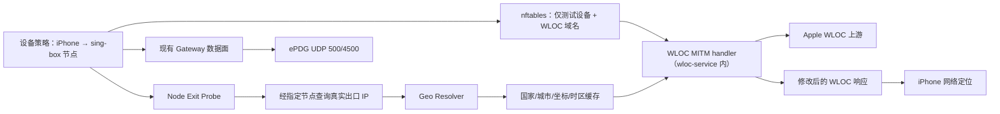

# 独立 WLOC 路由器组件开发测试计划

> **边界修订（2026-08-22）**：本项目是独立的 WLOC 项目，不属于 Wi-Fi
> Calling Gateway，也不依赖、打包、读取或管理 `luci-app-wificalling-gateway`
> / `wificalling-gateway`。本文早期出现的 Gateway 1.7 内容仅为历史背景，
> 不再是 V2 的产品依赖或发布门禁。以
> [ADR 0003](docs/adr/0003-standalone-wloc-product-boundary.md) 为准。

## 1. 权威依据

本计划以 Codex 任务 `019feec1-a2dc-7a70-bdba-3c2fc0176b14` 为唯一会话依据。该任务标题为“部署 server.js 到 Cloudflare (2)”，已按游标完整读取 12 页、117 个回合。

会话最终形成的方案不是继续部署地图或 Cloudflare，而是：

> 独立 WLOC 服务通过本项目维护的节点引用和 sing-box provider 检测真实出口
> IP，将 IP 解析为国家、城市、经纬度和时区，再只拦截目标设备的 Apple WLOC
> 请求，使设备网络定位自动跟随该设备档案绑定的节点出口。

明确决策：

- 不需要地图；
- 不需要 Cloudflare Worker/KV/TOKEN；
- 不需要手机端 Shadowrocket WLOC 模块；
- iPhone 只需安装并信任一次网关 CA；
- 第一阶段建立独立实验项目 `wificalling-location-gateway`；
- V1 PoC 的拆分设想已由 V2 产品设计取代：独立 WLOC 只有一个
  `wificalling-location-gateway` 产品包、一个统一 supervisor、一个管理界面和
  一套日志/监控/更新/回滚生命周期，不再把 Wi-Fi Calling Gateway 作为产品模块；
- `sing-box` 仍必须保留并复用，但 V2 不强制安装第二份完整二进制。优先复用
  AX6S 已实测的 `sing-box-tiny`/`sing-box-lite` 或 PassWall 提供的 sing-box，
  由运行时选择器验证路径和版本后交给统一 supervisor 管理；不接管 PassWall
  已运行的进程或配置；
- AX6S 持久空间不足时，测试前只备份并移除本项目旧 WLOC 包和本项目状态，保留
  独立的 sing-box provider；不得为了 WLOC 强制删除其他应用；
- 第一轮历史 PoC 使用 `/tmp` 临时运行的 ARM64 方式保留为回归参考，V2 验收以
  架构正确的集成包、迁移、重启、低空间和回滚实测为准。

### V2.0 authoritative addendum

本文件早期章节保留了 Phase 0–2 PoC 的历史背景。以下 V2 约束覆盖其中与
最终产品形态、运行时、打包和真机部署相冲突的旧建议：

- **产品形态**：独立 WLOC 共用 `wificalling-location-gateway` 包名、一个
  `wificalling-location-gateway` procd supervisor、一个管理界面和一套状态/日志/
  更新模型；任何 Gateway init/配置入口都不是运行依赖，只能在迁移工具中短期识别。
- **设备模型**：每台设备有独立档案，包含本项目节点绑定、WLOC 自动跟随、手动
  定位、服务启用状态、健康状态、日志和监控；`fixed` 只表示绑定该档案明确选定
  的 WLOC 节点，`auto` 跟随该节点出口，`manual` 写入该档案自己的坐标；多档案
  共享 sing-box provider 进程，不为每台设备复制完整代理进程。
- **低资源策略**：包不声明不可表达“tiny/lite/PassWall 任一 provider”的
  强制完整 sing-box 依赖；安装后检查器找不到 provider 时必须显式告警，统一
  服务保持安全失败/透传。
- **更新页**：组件更新必须是独立 LuCI 页面，并在应用前检查设备架构、固件系列、
  包格式、所需内核能力和剩余空间；不检查也不依赖 Gateway 版本。
- **语言**：所有 UI/RPC 英文为源文案，当前页面使用的中文均有正式 LuCI
  `po/zh_Hans` 语言包条目；因 AX6S 上的 LuCI 26 构建环境不能生成 `.lmo`，前端
  映射仅作为同一目录的轻量运行时兼容层，并由测试强制与正式 PO 保持覆盖和镜像一致。
- **验收状态**：主机测试、静态包检查和交叉编译不能替代 AX6S 的 RSS、CPU、
  存储、启动、升级中断恢复和回滚证据；没有脱敏真机证据不得标记 V2 发布通过。

## 2. 当前基线

### 2.1 历史 Gateway 参考（非本项目依赖）

仓库：`/Users/henry/Documents/Codex/2026-08-05/tiao`

本节只用于解释历史迁移背景；它不参与本项目构建、安装、运行、测试或发布。

- 当前提交：`b7cbe60`，与 `origin/main` 一致；
- 45 项测试通过；
- Shell `sh -n` 全部通过；
- LuCI JavaScript `node --check` 全部通过；
- 现有能力：节点管理、按设备分流、sing-box、nftables TPROXY、DHCP/MAC 自愈、UDP 500/4500 监控、活动日志、IPK/APK。

### 2.2 参考路由器

会话中已只读确认：

- Redmi AX6S；
- MediaTek MT7622，ARMv8 双核约 812MHz；
- ImmortalWrt 24.10.6，Linux 6.6.133；
- 总内存约 236.6MiB，当时可用约 49.7MiB；
- 持久存储约 85.6MiB，当时剩余约 21–26MiB；
- `/tmp` 剩余约 84.8MiB；
- 历史参考机曾安装 sing-box 1.13.16；V2 测试机可使用已实测的 tiny/lite
  版本或 PassWall 提供的 sing-box，具体 provider 必须记录在脱敏验收证据中；
- Gateway 本体约 96KB，删除它只能释放约 0.1MiB；
- 旧版完整 sing-box 二进制约 43.4MB；它属于历史资源基线。若测试机改用
  tiny/lite/PassWall provider，必须确认该 provider 仍由现有代理能力或
  统一 Gateway 生命周期复用，不能在没有替代 provider 的情况下删除 sing-box。

### 2.3 WLOC 参考实现

参考仓库：`mekos2772/ios-location-spoofer`。

- 已验证其包含 Apple WLOC response patch、location picker 和多代理客户端脚本；
- 许可证为 AGPL-3.0；
- Gateway 主项目为 MIT。

因此：不能直接把其源码复制进 MIT Gateway 包。实验项目必须独立许可；如果复用或派生 AGPL 代码，实验项目及网络服务修改需要按 AGPL 履行源代码义务。

## 3. 目标与非目标

### 3.1 PoC 目标

1. 指定一台测试 iPhone。
2. 复用 Gateway 中该设备绑定的 sing-box 节点。
3. 通过该节点检测真实出口 IP，而不是路由器 WAN IP。
4. 将出口 IP 解析为国家、城市、城市中心坐标和时区。
5. 只拦截该设备访问：
   - `gs-loc.apple.com`
   - `gs-loc-cn.apple.com`
6. 支持 Apple WLOC 所需 TLS、HTTP/2、二进制/protobuf 响应解析和修改。
7. 返回合理的城市级低精度位置。
8. 不运行 Shadowrocket 时，iPhone 网络定位随节点出口变化。
9. 不影响普通 HTTPS、UDP 500/4500、Wi-Fi Calling 注册和真实通话。
10. PoC 失败后重启或执行停止脚本即可完整恢复。

### 3.2 非目标

- 不做地图和搜索选点；
- 不部署 Cloudflare Worker、KV 或 token；
- 不拦截所有 HTTPS；
- 不内置城市级 GeoIP 数据库；
- V1 PoC 不支持多设备并发；V2 产品必须支持有界的多设备独立档案；
- 不首发多架构；
- 不首期修改 Gateway 1.7 稳定代码；
- 不承诺运营商激活、真实 GPS 或紧急呼叫位置准确。

## 4. 推荐架构



### 4.1 Node Exit Probe

职责：

- 为每个使用中的节点启动隔离的临时探测；
- 确保请求经过指定 sing-box outbound；
- 查询出口 IP；
- 记录 `node_id / exit_ip / checked_at / probe_state`；
- 不改写正在运行的生产 sing-box 配置；
- 不记录节点密码、UUID、私钥或完整分享链接。

必须防止两类错误：

- 查询到路由器 WAN IP；
- 只用 ICMP/tcping 便把节点判定为真实代理可用。

### 4.2 Geo Resolver

PoC 使用在线 IP 地理位置服务并缓存：

```json
{
  "node_id": "uk_anytls",
  "exit_ip": "203.0.113.1",
  "country_code": "GB",
  "city": "London",
  "latitude": 51.5074,
  "longitude": -0.1278,
  "timezone": "Europe/London",
  "checked_at": 0,
  "expires_at": 0
}
```

要求：

- 出口 IP 未改变时不重复查询；
- 至少支持主/备 provider；
- provider 返回冲突时标记 `geo_uncertain`，不静默选错；
- API 不可用时使用未过期缓存；
- 没有可靠数据时 WLOC 引擎透传原响应；
- 不回落到 Cupertino 或其他固定默认坐标；
- 对经纬度、国家码、时区做严格校验。

### 4.3 WLOC MITM handler（V2 内嵌于 wloc-service）

职责：

- 终止 iPhone 到 Apple WLOC 域名的 TLS；
- 使用路由器本地 CA 动态签发仅限目标 hostname 的证书；
- 支持 TLS 1.2/1.3、ALPN 和 HTTP/2；
- 转发上游请求；
- 解析原始 WLOC 二进制/protobuf 响应；
- 只修改与定位相关的坐标和精度字段；
- 保留未知字段和响应结构；
- 将上游错误、未知协议或解析失败安全透传。

建议响应使用城市级、非导航级精度：

```text
latitude/longitude：出口城市中心或可靠 IP 库坐标
horizontalAccuracy：建议 3–10km，最终以真机行为验证
verticalAccuracy：保守低精度
altitude：缺数据时不伪造高精度值
```

### 4.4 流量隔离

nftables 必须使用独立的 `wificalling_location` table/chain，禁止复用或改写现有 `wificalling_gateway` 数据面规则。现有规则会把策略设备的全部 TCP/UDP 送入 sing-box，不具备 WLOC 域名级 MITM 隔离能力。

nftables 规则必须同时匹配：

- 测试设备源 IP；
- Apple WLOC 目标集合；
- TCP 443。

不得拦截：

- 其他 LAN 设备；
- 测试 iPhone 的普通 HTTPS；
- UDP 500/4500；
- Gateway 的 sing-box 管理和健康检查流量；
- 路由器管理页面。

WLOC 域名解析得到的 IP 应通过 dnsmasq nftset/ipset 动态维护，并处理地址变化和 IPv6。

IPv6 是 PoC 的硬门禁：现有 Gateway 只有 `clients4` 和 IPv4 私网校验。如果 iPhone 通过 AAAA 访问 Apple WLOC，可能绕过 MITM 或形成 IPv4/IPv6 分裂状态。PoC 必须二选一并明确测试：

1. 完整实现 `clients6`、WLOC destination v6 nft set 和 IPv6 redirect；或
2. 在测试设备范围内显式抑制 WLOC AAAA，并证明普通 IPv6 流量策略不被意外改变。

未完成其中之一，不允许连接真机。

### 4.5 CA 管理

- 首次启动在路由器本地生成专用 CA；
- CA 私钥权限 0600，只允许 root 读取；
- LuCI 仅提供 CA 公钥证书下载、SHA-256 指纹和安装说明；
- 不上传 CA 私钥，不写入日志或支持包；
- 提供重新生成、撤销信任和删除证书步骤；
- 引擎禁用后不得继续保留透明转发规则；
- CA 与 Gateway 节点密钥分开存储和备份。

CA 生命周期必须自动化验收：

- 私钥始终 0600；
- LuCI、日志、支持包和普通配置备份不包含私钥；
- leaf certificate SAN 只能是两个精确 Apple hostname；
- CA 重新生成后必须清空旧 leaf cache；
- stop 操作先撤销 redirect，再停止引擎；
- 卸载时询问是否删除 CA，避免无提示破坏用户已信任的证书链。

### 4.6 精确定义 fail-open

| 故障 | 必须行为 |
|---|---|
| Geo provider 不可用且无有效缓存 | 转发 Apple 原始 WLOC 响应，不修改位置 |
| WLOC parser/patch 失败 | 转发原始响应，不返回默认坐标 |
| Apple 上游证书验证失败 | 不生成位置；返回受控失败并记录最小错误信息 |
| MITM 进程死亡或健康检查失败 | watchdog 立即移除/禁用 WLOC redirect，不能长期黑洞 |
| 节点出口探测失败 | 保留最后有效且未过期缓存；否则透传 |
| 响应超过大小/解压上限 | 不解析、不缓存、不记录正文；按策略透传或受控失败 |

## 5. 项目结构

独立 WLOC 项目结构：

```text
wificalling-location-gateway/
  src/                    # Rust service, proxy, WLOC, Geo and runtime
  openwrt/files/          # unified procd/UCI/network/package files
  openwrt/luci-app-*/     # integrated LuCI, ACL and rpcd surface
  scripts/                # package, migration, update and verification tools
  tests/                  # unit, integration, package and resource contracts
  docs/                   # API, deployment, operations and release evidence
  SECURITY.md
  LICENSE
  README.md
```

本项目不接受 Gateway payload，也不在构建阶段读取或补丁任何外部 Gateway
IPK。sing-box 只作为可选 provider，在设备上运行时检测。

## 6. 技术选型门禁

### 6.1 实现语言

V2 使用 Rust 实现统一服务，因为 TLS、HTTP/2、protobuf、静态 AArch64 交叉编译
和当前代码验证链已经冻结。资源门禁：

- ARM64 集成运行时二进制合计 ≤8MiB；
- 集成安装包 ≤20MiB；
- 持久状态 ≤10MiB，日志/缓存各自 ≤1MiB；
- 空闲 RSS ≤25MiB，峰值 RSS ≤35MiB；
- AX6S 实测峰值必须 ≤25MB 才进入长期驻留评估。

Rust release 二进制、包大小、RSS/CPU/启动和低空间行为均须分别通过主机
门禁与 AX6S 脱敏证据；主机门禁不得冒充真机 RSS 通过。

### 6.2 GeoIP

PoC：在线 provider + 本地缓存。

暂不内置：

- 国家库约 5–15MB 安装占用；
- 城市库约 50–120MB 安装占用；
- 当前 AX6S 剩余闪存不适合城市库。

### 6.3 V2 包形态

V2 正式交付一个架构相关的独立 WLOC 包：

```text
wificalling-location-gateway
  wloc-service/wloc-ctl、独立 supervisor、LuCI、WLOC UCI、ACL、
  日志/诊断/更新/回滚脚本
```

包内不复制第二份 sing-box；运行时选择 AX6S 已有 tiny/lite/PassWall
provider。旧 WLOC 包仅用于一次升级迁移和回滚兼容，不是 V2 最终管理入口。

## 7. 资源预算

### PoC 硬门禁

| 项目 | 上限 |
|---|---:|
| `/tmp` 二进制与临时文件 | 8MB |
| 运行内存目标 | 15–25MB |
| 持久 UCI/CA/缓存 | 200KB |
| 持久日志 | 1MB |
| 并发测试设备 | 1 |
| WLOC 拦截域名 | 2 |

V2-08 将上述目标固化为包内的
`/usr/share/wificalling-location-gateway/resource-budget.conf`：运行时三枚
二进制合计不超过 8MiB，集成包不超过 20MiB，持久状态不超过 10MiB，日志与
缓存各自总量不超过 1MiB，最多 8 个设备档案，启动不超过 10 秒，空闲 RSS
不超过 25MiB、峰值 RSS 不超过 35MiB、探测 CPU 不超过 30%。二进制与可选
包 artifact 在 CI 中硬拦截；RSS/CPU/启动时间通过统一脚本和 AX6S 脱敏证据
验收，未取得真机证据前不得宣称硬件通过。

运行时还必须限制：

- 总连接数；
- 单设备连接数；
- HTTP/2 concurrent streams；
- 压缩前/后 body 大小及解压倍率；
- 请求、握手、上游连接和空闲超时；
- procd respawn 频率；
- 日志轮转总量 ≤1MB。

### 正式包预估

| 项目 | 下载包 | 安装后 |
|---|---:|---:|
| LuCI/脚本/配置 | 20–100KB | 100–300KB |
| CA/缓存 | 可忽略 | 50–200KB |
| Rust wloc-service/wloc-ctl 及脚本 | 约 1–4MB | 约 2–8MB |
| 合计集成包 | 以 20MiB 硬门禁为准 | 以 20MiB 硬门禁为准 |

在 AX6S 上，只有实际安装后仍保留至少 10MiB 系统余量，才允许从 `/tmp` PoC 转为持久安装。

## 8. 开发阶段

### Phase 0：证据与协议冻结（3–5 天）

- 获取合法授权的 WLOC 请求/响应测试样本；
- 确认 protobuf 字段、重复字段、未知字段保留规则；
- 确认 iOS 版本、Apple hostname、TLS/ALPN/HTTP2 行为；
- 确认参考 WLOC 实现许可证和可复用范围；
- 完成威胁模型和 ADR。

退出条件：没有真实设备流量就不开始实现 response patch。

额外硬门禁：在 Phase 0 必须书面选择许可证路线：

- 复用/派生参考实现 → 独立实验项目采用 AGPL 并提供对应源码；或
- 未来希望 MIT 兼容 → 使用 clean-room fixtures/协议笔记，开发者不得移植参考实现源码。

### Phase 1：Node Exit Probe（2–4 天，TDD）

- 从 Gateway 导出的最小节点配置建立临时 outbound；
- 通过指定节点查询出口 IP；
- 超时、错误凭据、DNS、节点黑洞测试；
- 进程/端口/临时文件清理；
- 输出脱敏 JSON。

退出条件：能稳定区分 WAN IP、可达节点和真实代理出口。

### Phase 2：Geo Resolver（2–3 天，TDD）

- provider adapter；
- schema 校验；
- 主备冲突；
- 缓存/过期；
- 无数据 fail-open；
- 无默认假坐标。

退出条件：节点出口改变时坐标更新；API 故障时行为可预测。

### Phase 3：离线 WLOC Patch 核心（5–8 天，TDD）

- fixture parser；
- 字段定位和坐标替换；
- 未知字段保留；
- malformed/truncated/oversized input；
- 多响应/边界值；
- fuzzing。

退出条件：所有 fixture 可 round-trip；非目标字段字节级保持或语义保持。

### Phase 4：TLS/HTTP2 MITM（7–10 天，TDD）

- CA、叶证书、SAN；
- TLS 1.2/1.3；
- ALPN h2/http1.1；
- HTTP/2 streaming/body limits；
- 上游证书验证；
- 超时与连接复用；
- 解析失败透传；
- 普通域名拒绝代理。
- 连接/stream/body/解压/内存硬上限；
- 引擎死亡时的 redirect 自动撤销。

退出条件：只对测试域名工作；测试 CA 未安装时失败方式明确；普通 HTTPS 无影响。

### Phase 5：OpenWrt `/tmp` PoC（4–6 天）

- ARM64 交叉编译；
- 临时 init/stop/rollback 脚本；
- dnsmasq nftset + nftables 精确重定向；
- 独立 `wificalling_location` table/chain，不修改现有 Gateway table；
- IPv6 完整路径或 WLOC AAAA 精确抑制；
- 单设备绑定；
- 资源与日志上限；
- 路由器重启自动清理。

退出条件：停止脚本和重启都能恢复原始网络；不需要卸载 sing-box。

### Phase 6：历史 PoC iPhone 真机验证（历史记录）

本节保留早期 Gateway/WLOC 合并 PoC 的验证步骤，不是当前 v2 发布门禁。
当前独立 WLOC 的实机证据以
[`docs/testing/AX6S_REAL_DEVICE_2026-08-22.md`](docs/testing/AX6S_REAL_DEVICE_2026-08-22.md)
为准；真实 iPhone WLOC 流量仍是未完成的附加验证项。

按顺序测试：

1. 保留 Gateway 1.7 配置备份；
2. 固定测试 iPhone IP；
3. 安装并核对网关 CA 指纹；
4. 不运行 Shadowrocket；
5. 选择 UK 节点，确认出口 IP/城市；
6. 触发 Apple 网络定位，确认定位到 UK 城市；
7. 切换 US/HK 节点，确认定位跟随；
8. 检查 Safari 普通 HTTPS 证书未被网关签发；
9. 检查 UDP 500/4500 和 ASSURED；
10. 真实呼入/呼出测试；
11. 引擎停止、CA 撤销、网络恢复；
12. 重复至少 3 次。

退出条件：成功可重复、失败可恢复、没有普通 HTTPS 扩大拦截。

### Phase 7：V2 LuCI 与持久包

- 基础设置、统一启停、CA/指纹、provider 状态和资源提示；
- 多设备独立档案：节点调用、自动跟随、手动定位、启用状态、健康、日志和监控；
- 结构化日志、存储上限、支持包、组件更新、空间检查和回滚入口；
- 不显示地图，不显示虚假的“Wi-Fi Calling 已激活”；
- 一个架构相关集成 IPK/APK，旧组件入口仅作为迁移兼容层。

### Phase 8：V2 独立 WLOC 统一生命周期

- 独立 WLOC 的统一 supervisor 管理服务、provider 检查和 redirect；旧 WLOC
  入口不得独立 respawn 或拥有 redirect，外部 Gateway 不属于运行时；
- feature flag 默认关闭；WLOC 故障必须回到安全 passthrough，不得扩大拦截范围；
- 配置迁移保留 UCI/CA，空间不足、更新中断和回滚必须有明确失败路径；
- 真机验收前不得发布，真实 AX6S 证据必须覆盖低内存、低存储、重启、升级和回滚。

V2 的代码、UI、迁移和真机验收按 GitHub Issue #41 的工作包和退出条件执行，
不再使用早期 PoC 的 35–55 个开发日估算作为发布标准。

## 9. 测试矩阵

### 9.1 WLOC 离线单元测试

- 合法响应解析/重编码；
- 经纬度正负、边界和精度；
- 多 AP/多 cell 记录；
- 未知字段保留；
- 字段顺序变化；
- malformed/truncated/oversized body；
- gzip/压缩响应和解压倍率炸弹；
- 非 WLOC protobuf 拒绝；
- fuzz 测试不 panic、不越界、不无限分配。

### 9.2 TLS/HTTP2

- CA/叶证书签发与过期；
- SAN 精确匹配；
- TLS 1.2/1.3；
- ALPN h2；
- 多 stream；
- h2 stream 数量、连接数、body 与解压上限；
- upstream cert invalid；
- body size/timeouts；
- 未信任 CA；
- 非 allowlist hostname 不签发、不代理；
- CA 私钥权限和日志泄露测试。

### 9.3 Exit/Geo

- 经指定节点得到出口 IP；
- 不得得到 WAN IP；
- 节点 host reachable 但代理失败；
- provider 超时/限流/坏 JSON/冲突；
- 缓存命中/过期；
- exit IP 变化；
- IPv4/IPv6；
- 无可靠位置时透传。

### 9.4 OpenWrt 集成

- 只匹配指定设备；
- 只匹配两个 WLOC 域名；
- 独立 nft table，不修改 `wificalling_gateway`；
- WLOC A/AAAA 地址变化与 IPv6 路径；
- 普通 HTTPS 不进 MITM；
- UDP 500/4500 不进 MITM；
- stop/restart/crash 后 nftables 清理；
- dnsmasq reload；
- Gateway/sing-box 并存；
- 资源上限和日志轮转；
- reboot 恢复。
- MITM 进程 kill -9 后 redirect 自动撤销；
- CA 轮换、leaf cache 清理、卸载保留/删除选择。

### 9.5 真机负向场景

| 场景 | 预期 |
|---|---|
| 未安装 CA | WLOC MITM 不成功，但普通网络正常 |
| CA 已撤销 | 定位恢复真实/Apple 原始响应 |
| Geo API 离线且无缓存 | 原始响应透传，不返回默认假位置 |
| 节点黑洞 | 不更新位置，Gateway 状态显示失败 |
| 节点国家切换 | 缓存更新后定位跟随 |
| iOS 定位缓存 | 显示引擎已修改但提示设备缓存，按版本执行重启 |
| GPS 信号很强 | 网络位置可能不主导，不能误判引擎失败 |
| 其他 LAN 设备 | 证书和流量完全不受影响 |
| 引擎崩溃 | nftables watchdog/stop 清理，网络恢复 |
| 路由器重启 | PoC 自动消失，正式版按配置恢复 |

## 10. 安全与合规门禁

### 必须满足

- 用户明确授权测试自己的 iPhone 和局域网；
- UI 明确说明存在 TLS MITM；
- 只拦截两个 Apple WLOC 域名；
- CA 私钥只在路由器本地；
- 不记录完整 WLOC 请求、Wi-Fi/BSSID/cell 原始数据；
- 不记录节点密钥；
- 调试包自动脱敏；
- 引擎默认关闭；
- 提供一键停止、规则清理和 CA 撤销步骤；
- 不宣传为紧急呼叫位置保证；
- 不把网络证据描述为运营商激活结论。

日志 schema 只允许：事件类型、精确 allowlist hostname、成功/失败结果、请求/响应字节数、粗粒度国家/城市和经过散列的设备标识。支持包必须有自动脱敏测试。

### 许可证

- Gateway：MIT；
- `mekos2772/ios-location-spoofer`：AGPL-3.0；
- 新项目若复用其代码，必须保留 AGPL 边界和源代码提供机制；
- 若采用独立实现，也需记录 clean-room 证据和所用协议资料来源；
- PoC 通过前不得复制代码进入 Gateway 仓库。

## 11. 发布/回滚策略

### V1 PoC historical path

- 二进制和规则放 `/tmp`；
- 不覆盖 Gateway 配置；
- 测试前备份 UCI/nftables/证书状态；
- `rollback-poc.sh` 删除进程、规则、nft set 和临时证书；
- 重启作为最终恢复手段。

### V2 product path

- 一个 `wificalling-location-gateway` 独立 WLOC 包和统一 supervisor；
- feature flag 默认关闭，WLOC 失败时保持安全透传；
- AX6S 安装前先停止、禁用并卸载旧 WLOC 应用包，保留选定的
  tiny/lite/PassWall sing-box provider；
- 卸载前先停止并清理规则；CA 私钥仅在用户明确选择时删除；
- 更新事务必须保留配置/CA、检查空间、保留回滚包，并在中断后可恢复；
- WLOC 统一管理，但旧 WLOC 入口在一版迁移期内只提供兼容 facade；不得恢复
  外部 Gateway 作为运行依赖。

## 12. 第一迭代任务清单

第一迭代只执行 Phase 0–2：

1. 建立独立仓库和许可证边界；
2. 固化真实 WLOC fixtures；
3. 输出协议与威胁模型 ADR；
4. 开发指定节点出口 IP 探测；
5. 开发在线 Geo resolver + 缓存；
6. 在 Mac/Linux 上完成全部单元测试；
7. 暂不连接 iPhone、暂不生成 CA、暂不修改路由器。

完成评审后才进入 WLOC patch 和 TLS MITM，避免在协议未冻结前直接操作真机网络。

安全门禁：Phase 0–2 结束时如果独立 nft/IPv6 设计、CA 生命周期测试、fail-open 状态机或许可证路线仍未冻结，项目继续停留在离线阶段，不进入 MITM 开发。
