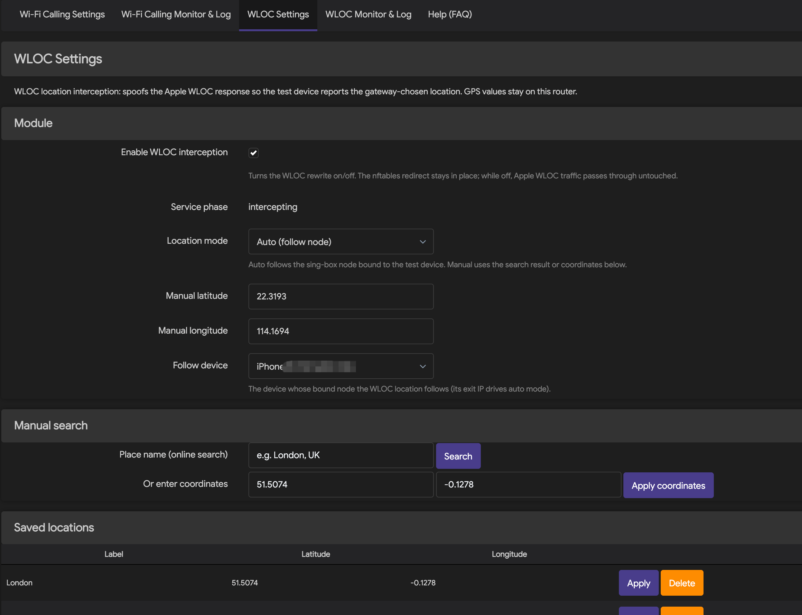
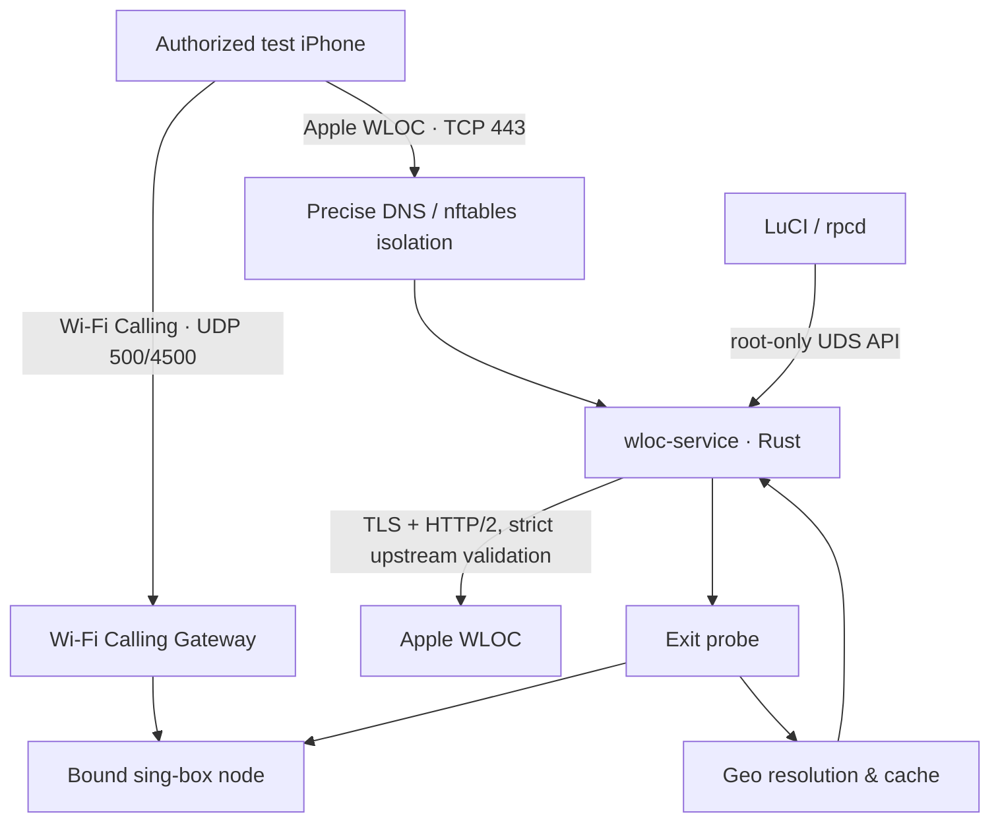
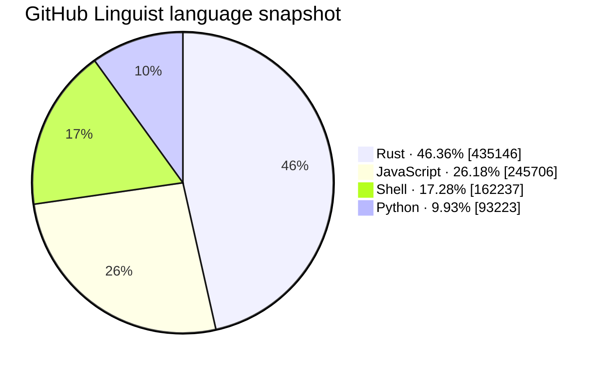
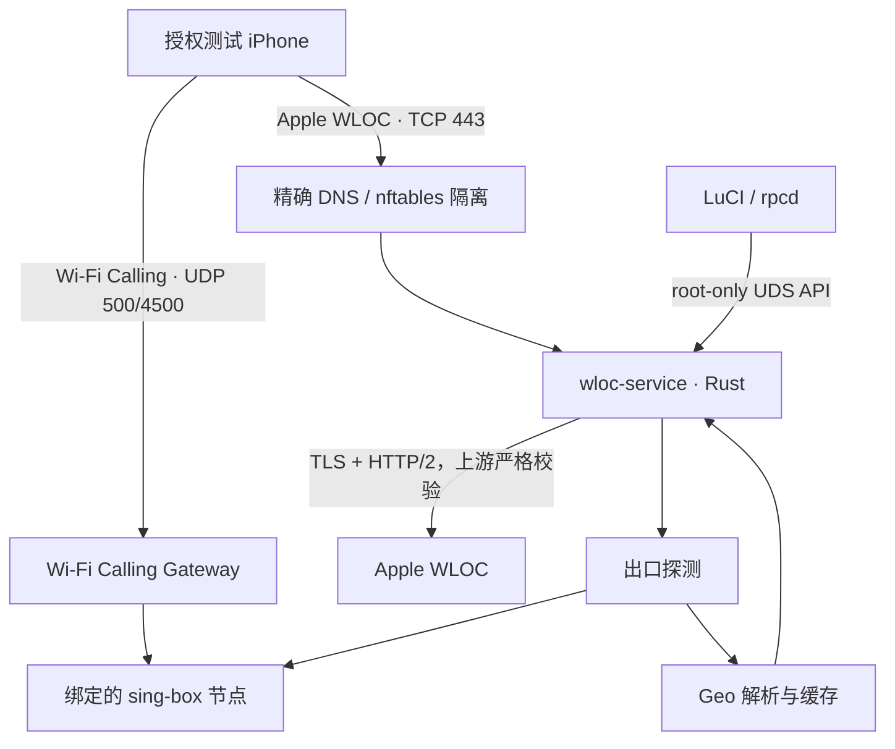

# Wi‑Fi Calling Location Gateway

<div align="center">

**An all-in-one Wi‑Fi Calling + Apple WLOC gateway for OpenWrt / ImmortalWrt**

A standalone Rust service handles exit geolocation, WLOC response rewriting, certificate lifecycle, precise traffic isolation, and LuCI management — all integrated into a single installable package.

[](https://github.com/smthdagg/wificalling-location-gateway/actions/workflows/ci.yml)
[](https://github.com/smthdagg/wificalling-location-gateway/releases/tag/v1.3.0-r1)
[](LICENSE)
[](Cargo.toml)
[](#support-and-validation-status)
[](https://github.com/smthdagg/wificalling-location-gateway/stargazers)
[](https://linux.do/)

[English Guide](docs/WIFICALLING_WLOC_TUTORIAL_EN.md) · [中文完整教程](docs/WIFICALLING_WLOC_TUTORIAL_ZH.md) · [Security Policy](SECURITY.md) · [Development & Test Plan](DEVELOPMENT_TEST_PLAN.md)

</div>

> [!IMPORTANT]
> This project is intended for authorized devices, networks, and test environments only. It does not prove that your carrier has enabled Wi‑Fi Calling, and it is not a substitute for real call verification; WLOC target locations must never be treated as emergency-call location. Follow local law, carrier terms, and Apple device-management requirements.



---

## English

## Introduction

Wi‑Fi Calling Location Gateway brings two previously separate flows together on one router:

1. **Wi‑Fi Calling Gateway** selects a sing-box node for designated LAN devices and keeps the ePDG/IPsec channel (UDP 500/4500) independent.
2. **The WLOC service** handles only TCP 443 traffic from the designated test device to the Apple WLOC hosts. In auto mode it resolves the target region from the exit IP of the node bound to that device; in manual mode it uses administrator-chosen coordinates.
3. **The LuCI interface** provides nodes, device policies, auto/manual location, certificate installation, runtime status, and a sanitized event log.

The core boundary of the project is "**independent, precise, and revertible**": WLOC uses its own process, UCI config, Unix socket, nftables table, and logs. It never takes over the Gateway's nftables table and never intercepts UDP 500/4500. When the protocol is unknown, Geo data is invalid, or the service is unhealthy, no default fake coordinates are produced.

## Features

- Statically linked Rust daemon optimized for OpenWrt musl targets and small release size.
- Auto-follows the country, city, timezone, and coordinates of the node bound to the device; after a node switch the monitor follows within about 10 seconds, and a one-click "Refresh IP" button re-probes immediately.
- Manual place search, latitude/longitude entry, and saved location presets.
- The certificate link, DNS hijack, and TPROXY rules are generated from the router's actual LAN IP at runtime — no more hardcoded 192.168.31.x, so any LAN subnet works out of the box.
- Locally generated, persisted WLOC root CA with an iPhone `.mobileconfig` install entry and fingerprint verification.
- The "Add LAN device" dialog lists connected LAN devices (DHCP leases + ARP cache); picking one fills in the device name and the real IP automatically.
- Bounded TLS, HTTP/2, and WLOC protocol handling; upstream certificate and hostname verification is never downgraded.
- DNS/nftables isolation scoped to "designated device + authorized hosts + TCP 443".
- Root-only Unix socket control API with an rpcd-authorized LuCI bridge.
- Wi‑Fi Calling tunnel status, WLOC current target, and sanitized event log.
- WireGuard nodes are fully supported: pre-shared keys, standard
  `[Interface]`/`[Peer]` config import, real-handshake health checks, and
  WLOC follow-device exit probing through sing-box endpoints.
- Only the proxy nodes referenced by active device policies are compiled
  into `sing-box.json` and loaded into memory - unreferenced WireGuard
  tunnels and protocol stacks stay off, so memory scales with the nodes
  actually in use rather than the total configured (measured on AX6S:
  sing-box RSS ~19-23 MB → ~15 MB).
- Per-node **nodeTest** button: run a fresh connection test on demand -
  a real WireGuard handshake (bypassing the monitor's result cache) or a
  TCP reachability probe for other protocols - with the verified exit IP
  or a classified failure reason (missing config / timeout / unreachable)
  in a banner that stays until closed.
- A dedicated **Service Status** page (Services > Service Status) reports
  both services at a glance - daemon processes, config validity, nftables
  rules, build patches, and node health - refreshed every 10 seconds.
- IPK (OpenWrt 24.10 / iStoreOS 24.10) and native APK v3 (OpenWrt 25.12) packaging.
- Pinned SDK/toolchain digests, offline locked builds, dependency audit, coverage gate, and Docker boot verification.

## How it works



A location update roughly goes through these steps:

1. The router feeds only the assigned test device's Apple WLOC requests into the standalone service.
2. Auto mode probes the real exit through the device's bound sing-box node; manual mode reads locally stored coordinates.
3. The Geo layer validates country code, coordinate ranges, timezone, expiry, and provider responses — it never fabricates a result when data is unavailable.
4. The service rewrites a response only when the authorized protocol structure, resource limits, TLS/ALPN, and safety state all hold; otherwise it passes the original response through or withdraws the redirect.
5. LuCI shows the target location and network evidence; raw WLOC responses, node credentials, call content, and message content are never logged.

More detail: [WLOC Service API](docs/api/WLOC_SERVICE_API.md), [Threat model](docs/security/threat-model.md), and [fail-open constraints](docs/security/fail-open.md).

## Implementation

| Layer | Implementation | Key constraints |
|---|---|---|
| Service runtime | Rust 2021, Tokio, static musl ELF | Rust 1.90; release LTO, `opt-level=z`, panic abort |
| TLS / HTTP | rustls, ring, tokio-rustls, h2 | TLS 1.2/1.3, ALPN `h2`, strict upstream cert & hostname validation |
| WLOC protocol | standalone clean-room protocol model with bounded parsing | Unknown, malformed, or oversized content is never guessed or partially rewritten |
| Control plane | `wloc.service/v1`, 4-byte BE framing, JSON, Unix socket | 16 KiB max frame, 2s total timeout, socket 0600, no TCP management port |
| Exit & location | sing-box exit probe, Geo primary/fallback + cache, manual coordinates | Invalid or stale data never falls back to default coordinates |
| OpenWrt integration | procd, UCI, rpcd, dnsmasq, firewall4/nftables | WLOC keeps its own table; never touches the Gateway table or UDP 500/4500 |
| Admin UI | LuCI JavaScript | Auto/manual switch, certificate, status, and log; sensitive fields sanitized |
| Build & release | OpenWrt SDK / Docker images pinned by digest | locked/offline compile, SHA-256, architecture tag cannot masquerade as `all` |

## Support and validation status

"Installable" is not the same as "verified with a real iPhone / Wi‑Fi Calling". The table separates the evidence levels:

| Platform | Arch | Package manager | Current evidence | Status |
|---|---:|---|---|---|
| Redmi AX6S · ImmortalWrt 24.10.6 | MediaTek MT7622 / AArch64 | opkg | Exact r5 Lite asset installed and cold-booted; 20.4 MB overlay remained free; WCG/WLOC, tmpfs sing-box, nftables and config hashes passed; a real iPhone WLOC request was intercepted and synthesized | **Docker + router + iPhone WLOC passed** |
| OpenWrt 24.10.8 | x86_64 | opkg / IPK | Docker boot of init/ubus, integrated package install, service start, socket and v1 status checks | **Install matrix passed** |
| iStoreOS 24.10.5 | x86_64 | opkg / IPK | Same as above | **Install matrix passed** |
| OpenWrt 25.12.3 | x86_64 | apk / APK v3 | Same, using native APK v3, not a renamed IPK | **Install matrix passed** |
| Other OpenWrt / ImmortalWrt versions or CPUs | — | — | No device/SDK evidence yet | **Not verified** |

The runtime packages contain architecture-specific ELF files and **must match the router CPU architecture**. x86_64 packages are built with pinned SDKs; AX6S uses a separate AArch64 `cortex-a53` toolchain. The formal Docker matrix installs both runtime variants for all three targets (six assets, eight runtime cases). Docker verifies install and boot; the AX6S row adds real router and iPhone WLOC evidence.

## Installation

### Prerequisites

- firewall4/nftables, LuCI, and rpcd available. Standard additionally requires a firmware/feed `sing-box`; Lite bundles its own runtime.
- A fixed DHCP address for the test iPhone and a correct node binding in the Gateway.
- Router config backed up; WARP, Shadowrocket, or any other VPN on the phone stays off during router WLOC testing.
- Install this project's CA only on the dedicated test device and verify the certificate fingerprint.

### 1. Choose the right package

Release `v1.3.0-r1` provides two installation variants for each of three targets. Both belong to this project and contain the same WCG, WLOC, control tools, LuCI and saved UCI schema:

- Standard: `wificalling-location-gateway_1.3.0-r1_aarch64_cortex-a53.ipk`, `wificalling-location-gateway_1.3.0-r1_x86_64.ipk`, `wificalling-location-gateway-1.3.0-r1.apk`
- Lite: `wificalling-location-gateway-lite_1.3.0-r1_aarch64_cortex-a53.ipk`, `wificalling-location-gateway-lite_1.3.0-r1_x86_64.ipk`, `wificalling-location-gateway-lite-1.3.0-r1.apk`

Choose **Standard** when the firmware already supplies a suitable `/usr/bin/sing-box`. Choose **Lite** for constrained gateways such as AX6S: it stores a hash-pinned compressed sing-box in flash, transparently expands one shared copy into `/tmp`, and keeps only the single-worker/moderate-GC runtime profile without an artificial heap ceiling. Standard and Lite conflict intentionally and must not be installed together. Both preserve `/etc/config/wificalling-gateway` and `/etc/config/wloc-service`.

The variant suffix changes runtime ownership only; it does not create a separate product or restore split component packages.

Two ways to install:

**Method A — package feed (recommended)**: add the signed feed and `opkg install` directly:

```sh
# Import the feed signing key (one-time)
wget -O /etc/opkg/keys/f7050198aa77cf15 \
  https://raw.githubusercontent.com/smthdagg/wificalling-location-gateway-feed/main/wloc.pub
# Add the feed and install
echo "src/gz wloc https://smthdagg.github.io/wificalling-location-gateway-feed" \
  >> /etc/opkg/customfeeds.conf
opkg update && opkg install wificalling-location-gateway
```

**Method B — manual download**: grab the matching file from
[Releases](https://github.com/smthdagg/wificalling-location-gateway/releases)
and verify it against `SHA256SUMS` from the same release directory first.

Full instructions for both methods live in the
[feed repository](https://github.com/smthdagg/wificalling-location-gateway-feed)
(including the manual `.apk` install commands for OpenWrt 25.x).

### 2. Redmi AX6S (Lite recommended)

```sh
opkg install /tmp/wificalling-location-gateway-lite_1.3.0-r1_aarch64_cortex-a53.ipk
```

Back up both UCI files first. On storage-constrained AX6S units, stop the services and remove the old integrated and sing-box packages before installing Lite; do not delete the saved UCI files. The r5 Lite package replaces the separate sing-box package and owns its transparent wrapper.

### 3. OpenWrt 24.10 / iStoreOS 24.10 (IPK)

```sh
opkg install /tmp/wificalling-location-gateway_1.3.0-r1_x86_64.ipk
# Or use the corresponding Lite asset when a bundled, bounded runtime is preferred.
```

### 4. OpenWrt 25.12 (native APK v3)

```sh
apk add --allow-untrusted /tmp/wificalling-location-gateway-1.3.0-r1.apk
```

`--allow-untrusted` applies only to locally built packages that are not yet signed in a repository. Formal releases use repository signing; never rename an IPK into an APK.

### 5. Verify the services

```sh
test -S /var/run/wloc-service/control.sock
/usr/sbin/wloc-ctl status
/etc/init.d/wificalling-gateway status
logread -e wloc-service
```

The status response must contain `"api_version":"wloc.service/v1"`. If the LuCI menu did not refresh, clear the browser cache and log back in instead of reinstalling packages for other architectures.

## Usage order

Configure in this order to avoid mixing network and location problems:

1. Import or add nodes in **Wi‑Fi Calling Settings**, then Save & Apply.
2. In **Device Policies**, add the test iPhone with a fixed LAN IP, routing mode, and bound node; Save & Apply again.
3. Enable Wi‑Fi Calling on the iPhone and watch for UDP 4500 `ASSURED` in **Wi‑Fi Calling Monitor & Log**; always confirm with a real call in/out.
4. In **WLOC Settings**, copy the router-generated profile link and install it from Safari on the iPhone.
5. On the iPhone, enable full trust for `wloc-service root CA` under Settings → General → About → Certificate Trust Settings, and verify the fingerprint.
6. Turn on WLOC interception and choose **Auto (follow node)** or a manual location; Save & Apply.
7. Toggle airplane mode / Wi‑Fi or reopen Maps/Weather to trigger a location request.
8. Check the mode, country, city, timezone, coordinates, Geo state, and update time in **WLOC Monitor & Log**.

Step-by-step guides:

- [Wi‑Fi Calling + WLOC Complete User Guide (English)](docs/WIFICALLING_WLOC_TUTORIAL_EN.md)
- [Wi‑Fi Calling + WLOC 中文完整使用教程](docs/WIFICALLING_WLOC_TUTORIAL_ZH.md)
- [AX6S deployment and real-device validation record](docs/deployment/AX6S_DEPLOYMENT.md)

## Building and verifying from source

### Rust quality gate

```sh
./scripts/ci/verify.sh
```

This entry runs formatting, Clippy, unit/integration tests, Rust line coverage (minimum 80%), dependency audit, license policy, secret scan, release size, and repository contract checks. The formal 1.0 baseline is **69 Python tests passing, Rust line coverage ≥ 80%, and a release verification binary of about 0.97 MB**.

### AX6S / AArch64 cross build

```sh
OPENWRT_BIN_NAME=wloc-service \
OPENWRT_CROSS_CACHE_DIR=/tmp/wloc-rust-openwrt \
./scripts/ci/verify-rust-openwrt.sh
```

This pins the OpenWrt 24.10.8 `mediatek/mt7622` toolchain, Rust version, and SHA-256, and verifies the AArch64 ELF, static linking, and size. See [Rust OpenWrt cross-build notes](docs/testing/RUST_OPENWRT_CROSS_BUILD.md).

### x86_64 dual-format packaging

```sh
./scripts/openwrt/build-x86_64-runtime.sh \
  --out-dir "$PWD/dist/runtime/x86_64"

./scripts/openwrt/build-release-packages.sh \
  --version 1.3.0 \
  --release 4 \
  --arch x86_64 \
  --service-bin "$PWD/dist/runtime/x86_64/wloc-service" \
  --ctl-bin "$PWD/dist/runtime/x86_64/wloc-ctl" \
  --gateway-ipk /absolute/path/wificalling-location-gateway_1.3.0-r1_aarch64_cortex-a53.ipk \
  --gateway-sha256 <verified-sha256> \
  --out-dir "$PWD/dist/openwrt-release"
```

### Four-environment Docker install & start matrix for all release packages

```sh
./scripts/openwrt/verify-docker-matrix.sh \
  --dist-dir "$PWD/dist/wloc-openwrt-release-r4"
```

Builds use the official OpenWrt SDK pinned by digest; after dependency preparation, product compilation runs locked/offline with read-only sources in a network-disabled container. Full boundaries and results: [OpenWrt packaging and Docker matrix](docs/testing/OPENWRT_PACKAGE_DOCKER_MATRIX.md).

## Language composition

A GitHub Linguist byte snapshot of the current main branch (2026-08-19). The router product runtime is mainly Rust, with JavaScript driving the LuCI admin UI and Shell handling OpenWrt lifecycle and network integration; Python is mostly used for reproducible builds, fixture governance, and CI.



> The numbers drift as main updates; whether LuCI JavaScript, docs, and generated/excluded files count depends on GitHub Linguist rules. Do not judge the project's primary language by helper-tool bytes alone.

## Project structure

```text
src/                         Rust service, protocol, TLS/H2, exit & Geo modules
openwrt/                     procd/UCI, LuCI/rpcd, and OpenWrt package definitions
scripts/openwrt/             cross builds, dual-format packaging, Docker matrix
scripts/ci/                  coverage, security, dependency, and repository gates
tests/                       Rust, Python, JavaScript, and network-model tests
fixtures/                    synthetic/sanitized fixture contracts and validators
docs/                        API, security, deployment, testing, bilingual guides
.handoffs/                   reproducible multi-agent handoff records
```

## Security, privacy, and rollback

- The CA private key lives only on the router (mode 0600); it must never be committed to Git, support packages, or logs.
- No node secrets, tokens, raw captures, device identifiers, precise user locations, or raw WLOC responses are committed.
- Only the designated test device and an explicit host scope are allowed; normal HTTPS, other LAN devices, and UDP 500/4500 are not part of the WLOC data plane.
- When upstream validation, ALPN, resource limits, or Geo checks fail, the service must not keep running with a "looks successful" default location.
- On disable, the WLOC redirect is withdrawn first, then the engine is drained and stopped; before recovery, confirm the standalone nftables rules are gone.
- Deleting the `wloc-service root CA` profile on the iPhone revokes device trust; after regenerating the CA, reinstall and verify the new fingerprint on every test device.

Report vulnerabilities privately via [SECURITY.md](SECURITY.md); never paste certificates, IPs, node configs, or device information into public issues.

## Notes & gotchas

These come from the working model above (device → TPROXY intercept → wloc MITM → Apple WLOC), not theory. Each was hit in real testing.

- **PassWall coexistence.** This plugin uses its own `inet wificalling_gateway` table and its own `fwmark 0x66 → table 166` TPROXY return path, kept separate from PassWall. PassWall runs a global TPROXY on `inet passwall` (`PSW_MANGLE` / `PSW_NAT`) that would otherwise capture the test device's traffic before this plugin sees it. `passwall-bypass.sh` therefore inserts a `return` rule (`WFC_GATEWAY_BYPASS`) for each bound test-device IP into PassWall's chains. If that bypass is missing or stale, the device's Apple 443 traffic is silently taken by PassWall and the WLOC intercept never fires — the plugin looks installed but does nothing. Re-run the bypass whenever the device set changes.
- **wloc → Apple TPROXY loopback.** The WLOC service itself reaches `gs-loc.apple.com` as a client. Its outbound handshake rides the same TPROXY plumbing (`ip rule fwmark 0x66 lookup 166`, `ip route local 0.0.0.0/0 dev lo table 166`). If that mark, route table, or the `apple_hosts` set is wrong, the service's own outbound handshake is caught by its own redirect and loops — the device reaches wloc fine, but wloc cannot complete the handshake with Apple. This is the classic "device reaches the server, server can't reach Apple" symptom; check the nftables return path and `apple_hosts` before blaming DNS or the proxy node.
- **wloc → Apple response rewrite.** Even with a clean handshake, Apple rejects a proxied WLOC response unless the rewrite is exact (see `issue-17`): a duplicated `Content-Length` makes Apple return `400 Bad Request`; a response not forced to `Accept-Encoding: identity` comes back gzip-compressed and cannot be rewritten; and the 10-byte opaque header framing (`[0:2]=0x0001`, `[6:10]=u32 BE block length`) must be re-summed after the patch or `locationd` reads a truncated body.

## Contributing

This repository uses GitHub Issues as the only assignable work units, integrated through dedicated branches, path leases, reproducible handoffs, and cross-role reviews. Before committing:

1. Read [AGENTS.md](AGENTS.md) and the owned paths of the corresponding issue;
2. Write a failing test first, then the minimal implementation;
3. Run `./scripts/ci/verify.sh`;
4. Review the diff for secrets, keys, device data, and unrelated changes;
5. Merge through a Pull Request; security-sensitive changes must not be self-reviewed.

Detailed collaboration: [Multi-agent workflow](docs/MULTI_AGENT_WORKFLOW.md).

## Star growth


> The chart is regenerated daily by the `star-history-chart` workflow (or manually from the Actions tab). It uses GitHub's auto-injected `GITHUB_TOKEN` to read the star timeline and renders the SVG locally — the token never leaves GitHub's workflow environment and is never written to any repository file or third-party service. The chart lives on the `star-chart` branch and is embedded via the jsDelivr CDN.

If this project helps your OpenWrt / Wi‑Fi Calling experiments, a Star, a reproducible bug report, or a note in the [LINUX.DO](https://linux.do/) community is welcome. Please never publish personal locations, certificates, or proxy credentials in public content.

## License

This project's own code is licensed under the [MIT License](LICENSE). Lite release assets also contain sing-box under GPL-3.0-or-later; third-party components retain their own licenses. The MIT grant does not change the isolation requirements for external AGPL implementation material defined in the [clean-room boundary ADR](docs/adr/0001-license-boundary.md).

The Wi‑Fi Calling Gateway component was originally a separate project. This repository integrates it as a single installable package; formal builds accept only published IPKs validated by identity, version, and SHA-256.

---

## 中文

## 项目简介

Wi‑Fi Calling Location Gateway 将两个原本分离的流程组织在同一台路由器上：

1. **Wi‑Fi Calling Gateway** 为指定局域网设备选择 sing-box 节点，并保持 UDP 500/4500 的 ePDG/IPsec 通道独立运行。
2. **WLOC 服务**只处理指定测试设备发往 Apple WLOC 主机的 TCP 443 流量；自动模式根据该设备绑定节点的出口 IP 解析目标地区，手动模式使用管理员选择的坐标。
3. **LuCI 界面**提供节点、设备策略、自动/手动位置、证书安装、运行状态和脱敏日志入口。

项目的核心边界是”**独立、精确、可回退**”：WLOC 使用自己的进程、UCI 配置、Unix Socket、nftables 表和日志，不接管 Gateway 的 nftables 表，也不拦截 UDP 500/4500。遇到未知协议、无效地理数据或服务异常时，不生成默认虚假坐标。

## 主要能力

- Rust 静态守护进程，针对 OpenWrt 的 musl 环境和小体积发布配置优化。
- 自动跟随设备所绑定代理节点的出口国家、城市、时区和坐标；切换设备节点后约 10 秒内自动跟随，监控页也可一键“刷新 IP”立即重探测。
- 手动地点搜索、经纬度输入和常用位置预设。
- 证书与拦截全程适配任意局域网网段：证书链接、DNS 劫持和 TPROXY 规则按路由器实际 LAN IP 动态生成，不再写死 192.168.31.x。
- 本地生成并持久化 WLOC 根证书，提供 iPhone `.mobileconfig` 安装入口与指纹核验。
- “添加局域网设备”弹窗自动列出局域网内已连接设备（DHCP 租约 + ARP），选择后自动填入设备名称与真实 IP。
- 有界 TLS、HTTP/2 和 WLOC 协议处理；上游证书与主机名验证不降级。
- 精确到“指定设备 + 授权主机 + TCP 443”的 DNS/nftables 隔离。
- root-only Unix Socket 控制 API，以及经 rpcd 授权的 LuCI 管理桥接。
- Wi‑Fi Calling 隧道状态、WLOC 当前目标与脱敏事件日志。
- 每个节点提供 **nodeTest** 测试按钮：随时执行一次新的连接测试——WireGuard 节点进行真实握手（绕过监控循环的结果缓存），其他协议执行 TCP 连通性探测；结果显示出口 IP 或分类失败原因（配置缺失 / 超时 / 不可达），横幅带关闭按钮且不会自动消失。
- 只把设备策略实际引用的代理节点编译进 `sing-box.json` 并加载到内存——未引用的 WireGuard 隧道和协议栈不驻留，内存随实际使用节点数而非配置总数增长（AX6S 实测：sing-box RSS 从约 19-23 MB 降到约 15 MB）。
- IPK（OpenWrt 24.10 / iStoreOS 24.10）与原生 APK v3（OpenWrt 25.12）打包。
- 固定 SDK/工具链、离线锁定编译、依赖审计、覆盖率门禁和 Docker 启动验证。

## 工作原理



一次位置更新大致经历以下步骤：

1. 路由器只把已分配测试设备的 Apple WLOC 请求送入独立服务。
2. 自动模式经该设备绑定的 sing-box 节点探测真实出口；手动模式读取本地保存的坐标。
3. Geo 层对国家码、坐标范围、时区、有效期和提供方响应进行校验，不可用时不伪造结果。
4. 服务仅在授权协议结构、资源限制、TLS/ALPN 和安全状态全部满足时处理响应；否则转发原始响应或撤销重定向。
5. LuCI 展示目标位置与网络证据，不记录原始 WLOC 响应、节点凭据、通话内容或短信内容。

更详细的接口与安全设计见 [WLOC Service API](docs/api/WLOC_SERVICE_API.md)、[威胁模型](docs/security/threat-model.md) 和 [fail-open 约束](docs/security/fail-open.md)。

## 技术实现

| 层级 | 实现 | 关键约束 |
|---|---|---|
| 服务运行时 | Rust 2021、Tokio、静态 musl ELF | Rust 1.90；release LTO、`opt-level=z`、panic abort |
| TLS / HTTP | rustls、ring、tokio-rustls、h2 | TLS 1.2/1.3、ALPN `h2`、上游证书与主机名强校验 |
| WLOC 协议 | 独立 clean-room 协议模型与有界解析 | 未知、畸形、超限内容不猜测、不部分修改 |
| 控制面 | `wloc.service/v1`、4-byte BE 帧、JSON、Unix Socket | 最大 16 KiB、总超时 2 秒、Socket 0600、无 TCP 管理端口 |
| 出口与位置 | sing-box 出口探测、Geo 主备/缓存、手动坐标 | 无效或过期数据不回落到默认坐标 |
| OpenWrt 集成 | procd、UCI、rpcd、dnsmasq、firewall4/nftables | WLOC 独立表；不触碰 Gateway 表和 UDP 500/4500 |
| 管理界面 | LuCI JavaScript | 自动/手动切换、证书、状态和日志；敏感字段脱敏 |
| 构建发布 | 固定摘要的 OpenWrt SDK / Docker 镜像 | locked/offline 编译、SHA-256、架构标签不可伪装为 `all` |

## 支持范围与验证状态

“可安装”不等于“完成真实 iPhone/Wi‑Fi Calling 验证”。下表把证据等级分开列出：

| 平台 | 架构 | 包管理器 | 当前证据 | 状态 |
|---|---:|---|---|---|
| Redmi AX6S · ImmortalWrt 24.10.6 | MediaTek MT7622 / AArch64 | opkg | r5 Lite 原包已安装并冷启动；overlay 剩余 20.4 MB；WCG/WLOC、tmpfs sing-box、nftables 与配置哈希通过；已实际收到并处理 iPhone WLOC 请求 | **Docker + 路由器 + iPhone WLOC 通过** |
| OpenWrt 24.10.8 | x86_64 | opkg / IPK | Docker 中启动 init/ubus、安装集成包、启动服务、Socket 与 v1 状态检查 | **安装矩阵通过** |
| iStoreOS 24.10.5 | x86_64 | opkg / IPK | 同上 | **安装矩阵通过** |
| OpenWrt 25.12.3 | x86_64 | apk / APK v3 | 同上，使用原生 APK v3，非改名 IPK | **安装矩阵通过** |
| 其他 OpenWrt / ImmortalWrt 版本或 CPU | — | — | 尚无对应设备/SDK证据 | **未验证** |

运行时包包含与架构相关的 ELF，**必须与路由器 CPU 架构一致**。x86_64 使用固定 SDK，AX6S 使用 AArch64 `cortex-a53` 工具链。正式矩阵覆盖三类目标的 Standard/Lite 两种规格，共六个资产、八个运行用例；AX6S 另有真机与 iPhone WLOC 证据。

## 安装

### 前置条件

- firewall4/nftables、LuCI 与 rpcd 可用；Standard 还要求固件/软件源提供 sing-box，Lite 自带运行时。
- 为测试 iPhone 建立固定 DHCP 地址，并在 Gateway 中绑定正确节点。
- 已备份路由器配置；手机上的 WARP、Shadowrocket 或其他 VPN 在路由器 WLOC 测试期间保持关闭。
- 只在专用测试设备上安装本项目 CA，并核对证书指纹。

### 1. 选择正确的安装包

`v1.3.0-r1` 为三个目标各提供 Standard 与 Lite 两种安装规格。它们属于同一个项目，WCG、WLOC、控制工具、LuCI 与 UCI 数据结构完全一致：

- Standard：`wificalling-location-gateway_1.3.0-r1_aarch64_cortex-a53.ipk`、`wificalling-location-gateway_1.3.0-r1_x86_64.ipk`、`wificalling-location-gateway-1.3.0-r1.apk`
- Lite：`wificalling-location-gateway-lite_1.3.0-r1_aarch64_cortex-a53.ipk`、`wificalling-location-gateway-lite_1.3.0-r1_x86_64.ipk`、`wificalling-location-gateway-lite_1.3.0-r1.apk`

固件已有合适 `/usr/bin/sing-box` 时选择 **Standard**；AX6S 等受限设备推荐 **Lite**：flash 只保存带 SHA256 固定的压缩运行时，首次调用透明解压一份到 `/tmp`；WCG 仅保留单 worker 和适度 GC 设置，不再人为设置堆上限。两种规格故意互斥，不能同时安装；两者都保留 `/etc/config/wificalling-gateway` 与 `/etc/config/wloc-service`。

Lite 后缀只表示运行时所有权与内存策略不同，不是新项目，也不会恢复拆分组件安装。

两种安装方式：

**方式 A — 包源安装（推荐）**：添加签名包源后直接 `opkg install`：

```sh
# 导入源签名公钥（一次性）
wget -O /etc/opkg/keys/f7050198aa77cf15 \
  https://raw.githubusercontent.com/smthdagg/wificalling-location-gateway-feed/main/wloc.pub
# 添加源并安装
echo "src/gz wloc https://smthdagg.github.io/wificalling-location-gateway-feed" \
  >> /etc/opkg/customfeeds.conf
opkg update && opkg install wificalling-location-gateway
```

**方式 B — 手动下载**：从
[Releases](https://github.com/smthdagg/wificalling-location-gateway/releases)
下载对应文件，并先校验同一发布目录中的 `SHA256SUMS`。

两种方式的完整说明见
[feed 仓库](https://github.com/smthdagg/wificalling-location-gateway-feed)（含
OpenWrt 25.x 的 `.apk` 手动安装命令）。

### 2. Redmi AX6S（推荐 Lite）

```sh
opkg install /tmp/wificalling-location-gateway-lite_1.3.0-r1_aarch64_cortex-a53.ipk
```

安装前先备份两份 UCI 配置。AX6S 空间不足时，先停止服务并卸载旧整合包和旧 sing-box 包，再安装 Lite；不要删除 UCI 配置。r5 Lite 会替代独立 sing-box 包并拥有透明启动包装器。

### 3. OpenWrt 24.10 / iStoreOS 24.10（IPK）

```sh
opkg install /tmp/wificalling-location-gateway_1.3.0-r1_x86_64.ipk
# 需要内置、受限运行时时也可选择对应 Lite 文件。
```

### 4. OpenWrt 25.12（原生 APK v3）

```sh
apk add --allow-untrusted /tmp/wificalling-location-gateway-1.3.0-r1.apk
```

`--allow-untrusted` 仅适用于当前未接入软件源签名的本地构建包。正式软件源发布应使用仓库签名，且不能把 IPK 重命名为 APK。

### 5. 验证服务

```sh
test -S /var/run/wloc-service/control.sock
/usr/sbin/wloc-ctl status
/etc/init.d/wificalling-gateway status
logread -e wloc-service
```

状态响应应包含 `"api_version":"wloc.service/v1"`。如果 LuCI 菜单未刷新，请清理浏览器缓存并重新登录，而不是反复安装不同架构的包。

## 使用顺序

请按以下顺序完成配置，避免把网络问题与位置问题混在一起：

1. 在 **Wi‑Fi Calling Settings** 导入或添加节点，保存并应用。
2. 在 **Device Policies** 添加测试 iPhone、固定 LAN IP、路由模式和绑定节点，再次保存并应用。
3. 在 iPhone 开启 Wi‑Fi Calling，并在 **Wi‑Fi Calling Monitor & Log** 中观察 UDP 4500 `ASSURED`；最后必须以真实呼入/呼出确认。
4. 在 **WLOC Settings** 复制路由器生成的配置描述文件链接，用 iPhone Safari 下载并安装。
5. 在 iPhone 的“设置 → 通用 → 关于本机 → 证书信任设置”中，为 `wloc-service root CA` 开启完全信任，并核对指纹。
6. 开启 WLOC interception，选择 **Auto (follow node)** 或手动位置，保存并应用。
7. 切换飞行模式/Wi‑Fi 或重新打开地图、天气应用以触发位置请求。
8. 在 **WLOC Monitor & Log** 核对模式、国家、城市、时区、坐标、Geo 状态和更新时间。

完整图文步骤请阅读：

- [Wi‑Fi Calling + WLOC 中文完整使用教程](docs/WIFICALLING_WLOC_TUTORIAL_ZH.md)
- [Wi‑Fi Calling + WLOC Complete User Guide (English)](docs/WIFICALLING_WLOC_TUTORIAL_EN.md)
- [AX6S 部署与真机验证记录](docs/deployment/AX6S_DEPLOYMENT.md)

## 从源码构建与验证

### Rust 质量门禁

```sh
./scripts/ci/verify.sh
```

该入口执行格式、Clippy、单元/集成测试、Rust 行覆盖率（最低 80%）、依赖审计、许可证策略、秘密扫描、发布体积和仓库契约检查。正式版 1.0 验证基线为 **69 个 Python 测试通过、Rust 行覆盖率 ≥80%、release 验证二进制约 0.97 MB**。

### AX6S / AArch64 交叉构建

```sh
OPENWRT_BIN_NAME=wloc-service \
OPENWRT_CROSS_CACHE_DIR=/tmp/wloc-rust-openwrt \
./scripts/ci/verify-rust-openwrt.sh
```

该流程固定 OpenWrt 24.10.8 `mediatek/mt7622` 工具链、Rust 版本和 SHA-256，并验证 AArch64 ELF、静态链接与体积。详见 [Rust OpenWrt 交叉构建说明](docs/testing/RUST_OPENWRT_CROSS_BUILD.md)。

### x86_64 双格式打包

```sh
./scripts/openwrt/build-x86_64-runtime.sh \
  --out-dir "$PWD/dist/runtime/x86_64"

./scripts/openwrt/build-release-packages.sh \
  --version 1.3.0 \
  --release 4 \
  --arch x86_64 \
  --service-bin "$PWD/dist/runtime/x86_64/wloc-service" \
  --ctl-bin "$PWD/dist/runtime/x86_64/wloc-ctl" \
  --gateway-ipk /absolute/path/wificalling-location-gateway_1.3.0-r1_aarch64_cortex-a53.ipk \
  --gateway-sha256 <verified-sha256> \
  --out-dir "$PWD/dist/openwrt-release"
```

### 全部发布包的四环境 Docker 安装与启动矩阵

```sh
./scripts/openwrt/verify-docker-matrix.sh \
  --dist-dir "$PWD/dist/wloc-openwrt-release-r4"
```

构建使用固定摘要的官方 OpenWrt SDK；依赖准备之后，产品编译采用 locked/offline、只读源码和禁网容器。完整边界和结果见 [OpenWrt 发布打包与 Docker 矩阵](docs/testing/OPENWRT_PACKAGE_DOCKER_MATRIX.md)。

## 语言组成

下面是 GitHub Linguist 在 2026-08-19 对当前主分支给出的代码字节快照。路由器产品运行时以 Rust 为主，JavaScript 驱动 LuCI 管理界面，Shell 负责 OpenWrt 生命周期与网络集成；Python 主要用于可复现构建、fixture 治理和 CI。


> 统计会随主分支更新而变化；LuCI JavaScript、文档和生成/排除文件是否计入，以 GitHub Linguist 规则为准。项目的技术主语言不应只按仓库辅助工具的字节数判断。

## 项目结构

```text
src/                         Rust 服务、协议、TLS/H2、出口与 Geo 模块
openwrt/                     procd/UCI、LuCI/rpcd 与 OpenWrt 包定义
scripts/openwrt/             交叉构建、双格式打包与 Docker 矩阵
scripts/ci/                  覆盖率、安全、依赖和仓库质量门禁
tests/                       Rust、Python、JavaScript 与网络模型测试
fixtures/                    合成/授权脱敏 fixture 契约与校验器
docs/                        API、安全、部署、测试和双语用户教程
.handoffs/                   多 Agent 可复现接管记录
```

## 安全、隐私与回滚

- CA 私钥只保存在路由器本地，权限为 0600；不得提交到 Git、支持包或日志。
- 不提交节点密钥、Token、原始抓包、设备标识、精确用户位置或原始 WLOC 响应。
- 仅允许指定测试设备和明确主机范围；普通 HTTPS、其他 LAN 设备及 UDP 500/4500 不属于 WLOC 数据面。
- 上游验证、ALPN、资源上限或 Geo 校验失败时不得以“看似成功”的默认位置继续运行。
- 停用时先撤销 WLOC 重定向，再排空并停止服务；恢复前应确认独立 nftables 规则已消失。
- 删除 iPhone 上的 `wloc-service root CA` 描述文件即可撤销设备信任；重新生成 CA 后必须重新核对并安装新指纹。

漏洞请按 [SECURITY.md](SECURITY.md) 私下报告，并向公开 Issue 中贴证书、IP、节点配置或设备信息。

## 注意事项

以下条目来自上面的工作原理（设备 → TPROXY 拦截 → wloc 中间人 → Apple WLOC），均为实测踩坑，而非理论。

- **与 PassWall 共存。** 本插件使用独立的 `inet wificalling_gateway` 表，以及独立的 `fwmark 0x66 → table 166` TPROXY 回环路径，与 PassWall 隔离。PassWall 在 `inet passwall`（`PSW_MANGLE` / `PSW_NAT`）上做全局 TPROXY，否则会在本插件之前抢走测试设备的流量。`passwall-bypass.sh` 因此会为每个已绑定测试设备 IP 在 PassWall 链中插入一条 `return` 规则（`WFC_GATEWAY_BYPASS`）。若该旁路缺失或过旧，设备的 Apple 443 流量会被 PassWall 静默截走，WLOC 拦截根本不触发——插件看似已装，实则不工作。设备集合变化时务必重新执行旁路。
- **wloc → Apple 的 TPROXY 回环。** WLOC 服务自身以客户端身份访问 `gs-loc.apple.com`。它的出站握手复用同一套 TPROXY 机制（`ip rule fwmark 0x66 lookup 166`、`ip route local 0.0.0.0/0 dev lo table 166`）。若该 mark、路由表或 `apple_hosts` 集合写错，服务自身的出站握手会被自己的重定向规则捕获并回环——表现为“设备能连到 wloc 服务器，但 wloc 与 Apple 握手失败”。遇到“设备到服务端正常、服务端到 Apple 不通”这类症状，先查 nftables 回环路径与 `apple_hosts`，别急着怀疑 DNS 或节点。
- **wloc → Apple 响应重写。** 即便握手正常，Apple 仍会拒绝代理后的 WLOC 响应，除非重写精确（见 `issue-17`）：重复的 `Content-Length` 会让 Apple 返回 `400 Bad Request`；未强制 `Accept-Encoding: identity` 的响应会以 gzip 压缩返回、无法重写；且 10 字节不透明头帧（`[0:2]=0x0001`、`[6:10]=u32 BE block length`）在补丁后必须重算长度，否则 `locationd` 读到截断的 body。

## 参与开发

本仓库使用 GitHub Issue 作为唯一可分配工作单元，并以独立分支、路径租约、可复现 handoff 和异角色审查完成集成。提交前必须：

1. 阅读 [AGENTS.md](AGENTS.md) 与对应 Issue 的 owned paths；
2. 先写失败测试，再完成最小实现；
3. 运行 `./scripts/ci/verify.sh`；
4. 检查差异中没有秘密、私钥、设备数据和无关改动；
5. 通过 Pull Request 合并，安全敏感变更不得由作者自审。

详细协作方式见 [多 Agent 工作流](docs/MULTI_AGENT_WORKFLOW.md)。

## Star 增长


> 图表由 `star-history-chart` 工作流每日自动更新（也可在 Actions 页面手动运行）。它使用 GitHub 自动注入的 `GITHUB_TOKEN` 读取 star 时间线并在本地生成 SVG——token 只在 GitHub 的工作流环境内使用，不写入仓库任何文件，也不经过第三方服务。图表发布在 `star-chart` 分支，经 jsDelivr CDN 嵌入。

如果这个项目对你的 OpenWrt / Wi‑Fi Calling 实验有帮助，欢迎 Star、提交可复现的问题报告，或在 [LINUX.DO](https://linux.do/) 社区交流使用经验。请勿在公开内容中发布个人位置、证书或代理凭据。

## 开源许可

本项目自有代码采用 [MIT License](LICENSE)。Lite 发布资产还内含采用 GPL-3.0-or-later 的 sing-box；第三方组件继续遵循各自许可证。MIT 授权不改变 [clean-room 边界 ADR](docs/adr/0001-license-boundary.md) 对外部 AGPL 实现材料的隔离要求。

Wi‑Fi Calling Gateway 组件原为独立项目。本仓库将其整合为单一安装包；正式包构建只接受经过身份、版本和 SHA-256 校验的已发布 IPK。
