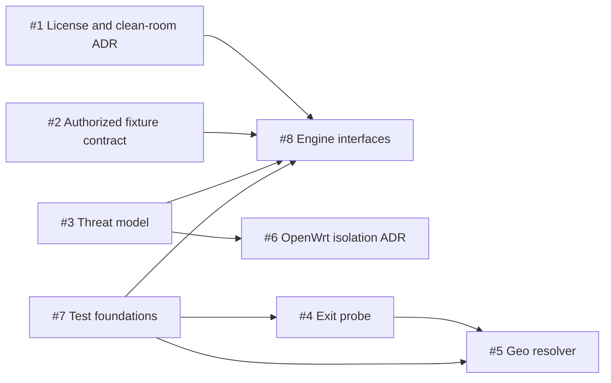

# Wi-Fi Calling Location Gateway

Private, security-gated development repository for an isolated OpenWrt WLOC location-gateway proof of concept. The component is designed to follow the real exit location of the sing-box node assigned by Wi-Fi Calling Gateway 1.7 without modifying the stable Gateway repository.

This repository is currently in Phase 0. It contains the architecture and multi-Agent control plane; it does **not** yet contain a production WLOC interception engine.

## Multi-Agent task graph



Seven tasks are ready for parallel work. Engine implementation remains blocked until the license boundary, authorized fixture contract, and threat model are closed.

## Start or resume an Agent

```sh
./scripts/agent-takeover.sh <issue> <agent-id> <slug> <capabilities> [ttl-minutes]
```

Example:

```sh
./scripts/agent-takeover.sh 4 terra-net exit-probe 'go,network,test' 120
```

Before the Agent pauses or another Agent takes over, update `.handoffs/issue-4.md`, commit it, then publish the checkpoint:

```sh
./scripts/agent-handoff.sh 4 terra-net 'go,network,test'
```

Each Agent keeps its own API key and login environment. Handoffs contain capability names and reproducible state only—never credentials. Every Agent must follow [AGENTS.md](AGENTS.md), and every pull request must run:

```sh
./scripts/ci/verify.sh
```

See [the multi-Agent workflow](docs/MULTI_AGENT_WORKFLOW.md) and [the development/test plan](DEVELOPMENT_TEST_PLAN.md) for the complete gates.

## Security and license status

Do not commit private keys, credentials, raw captures, device identifiers, or precise user location. See [SECURITY.md](SECURITY.md).

No open-source license is granted yet; absent a repository `LICENSE`, this work
remains all rights reserved by default. Issue #1's proposed
[ADR-0001](docs/adr/0001-license-boundary.md) selects an independent clean-room
implementation route and prohibits the AGPL reference implementation's source,
tests, fixtures, documentation text, repository structure, and source-derived
material from implementation branches, Issues, reviews, and AI prompts.

ADR-0001 does not authorize WLOC parsing, response patching, CA generation,
TLS interception, MITM, or live-device traffic. It becomes accepted only after
the independent protocol and security attestations recorded in the
[Issue #1 review record](docs/reviews/ISSUE_1_LICENSE_BOUNDARY_REVIEW.md) are
complete; separate fixture and threat-model gates remain mandatory.
