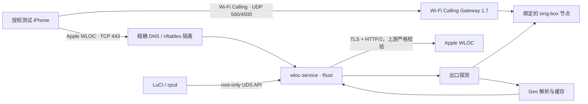
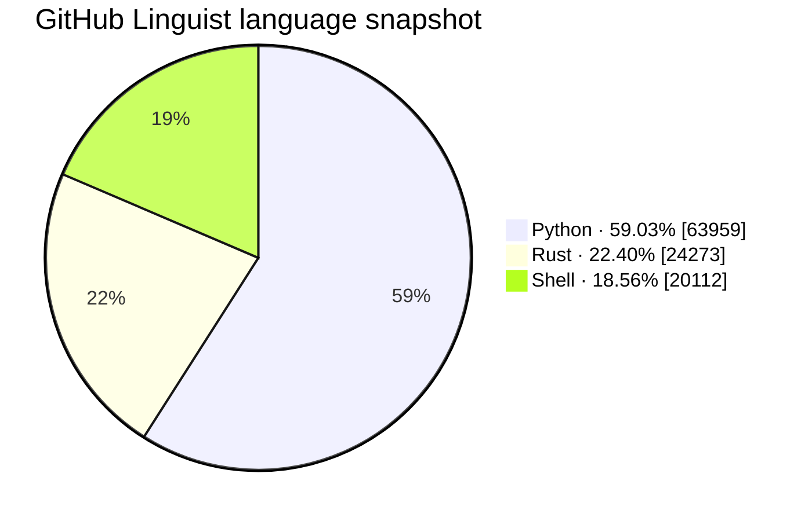

# Wi‑Fi Calling Location Gateway

<div align="center">

**面向 OpenWrt / ImmortalWrt 的 Wi‑Fi Calling + Apple WLOC 一体化网关**

在不修改 Wi‑Fi Calling Gateway 1.7 稳定数据面的前提下，以独立 Rust 服务完成出口定位、WLOC 定位响应处理、证书生命周期、精确流量隔离和 LuCI 管理。

[](https://github.com/smthdagg/wificalling-location-gateway/actions/workflows/ci.yml)
[](LICENSE)
[](Cargo.toml)
[](#支持范围与验证状态)
[](https://github.com/smthdagg/wificalling-location-gateway/stargazers)
[](https://linux.do/)

[中文完整教程](docs/WIFICALLING_WLOC_TUTORIAL_ZH.md) · [English Guide](docs/WIFICALLING_WLOC_TUTORIAL_EN.md) · [安全策略](SECURITY.md) · [开发与测试计划](DEVELOPMENT_TEST_PLAN.md)

</div>

> [!IMPORTANT]
> 本项目用于获得授权的设备、网络与测试环境。它不能证明运营商已经开通 Wi‑Fi Calling，也不能替代真实呼入/呼出验证；WLOC 目标位置不得被视为紧急呼叫定位。请遵守当地法律、运营商条款和 Apple 设备管理要求。


## 项目简介

Wi‑Fi Calling Location Gateway 将两个原本分离的流程组织在同一台路由器上：

1. **Wi‑Fi Calling Gateway 1.7** 为指定局域网设备选择 sing-box 节点，并保持 UDP 500/4500 的 ePDG/IPsec 通道独立运行。
2. **WLOC 服务**只处理指定测试设备发往 Apple WLOC 主机的 TCP 443 流量；自动模式根据该设备绑定节点的出口 IP 解析目标地区，手动模式使用管理员选择的坐标。
3. **LuCI 界面**提供节点、设备策略、自动/手动位置、证书安装、运行状态和脱敏日志入口。

项目的核心边界是“**独立、精确、可回退**”：WLOC 使用自己的进程、UCI 配置、Unix Socket、nftables 表和日志，不接管 Wi‑Fi Calling Gateway 1.7 的表，也不拦截 UDP 500/4500。遇到未知协议、无效地理数据或服务异常时，不生成默认虚假坐标。

## 主要能力

- Rust 静态守护进程，针对 OpenWrt 的 musl 环境和小体积发布配置优化。
- 自动跟随设备所绑定代理节点的出口国家、城市、时区和坐标。
- 手动地点搜索、经纬度输入和常用位置预设。
- 本地生成并持久化 WLOC 根证书，提供 iPhone `.mobileconfig` 安装入口与指纹核验。
- 有界 TLS、HTTP/2 和 WLOC 协议处理；上游证书与主机名验证不降级。
- 精确到“指定设备 + 授权主机 + TCP 443”的 DNS/nftables 隔离。
- root-only Unix Socket 控制 API，以及经 rpcd 授权的 LuCI 管理桥接。
- Wi‑Fi Calling 隧道状态、WLOC 当前目标与脱敏事件日志。
- IPK（OpenWrt 24.10 / iStoreOS 24.10）与原生 APK v3（OpenWrt 25.12）打包。
- 固定 SDK/工具链、离线锁定编译、依赖审计、覆盖率门禁和 Docker 启动验证。

## 工作原理



一次位置更新大致经历以下步骤：

1. 路由器只把已分配测试设备的 Apple WLOC 请求送入独立服务。
2. 自动模式经该设备绑定的 sing-box 节点探测真实出口；手动模式读取本地保存的坐标。
3. Geo 层对国家码、坐标范围、时区、有效期和提供方响应进行校验，不可用时不伪造结果。
4. 服务仅在授权协议结构、资源限制、TLS/ALPN 和安全状态全部满足时处理响应；否则转发原始响应或撤销重定向。
5. LuCI 展示目标位置与网络证据，不记录原始 WLOC 响应、节点凭据、通话内容或短信内容。

更详细的接口与安全设计见 [WLOC Service API](docs/api/WLOC_SERVICE_API.md)、[威胁模型](docs/security/threat-model.md) 和 [fail-open 约束](docs/security/fail-open.md)。

## 技术实现

| 层级 | 实现 | 关键约束 |
|---|---|---|
| 服务运行时 | Rust 2021、Tokio、静态 musl ELF | Rust 1.90；release LTO、`opt-level=z`、panic abort |
| TLS / HTTP | rustls、ring、tokio-rustls、h2 | TLS 1.2/1.3、ALPN `h2`、上游证书与主机名强校验 |
| WLOC 协议 | 独立 clean-room 协议模型与有界解析 | 未知、畸形、超限内容不猜测、不部分修改 |
| 控制面 | `wloc.service/v1`、4-byte BE 帧、JSON、Unix Socket | 最大 16 KiB、总超时 2 秒、Socket 0600、无 TCP 管理端口 |
| 出口与位置 | sing-box 出口探测、Geo 主备/缓存、手动坐标 | 无效或过期数据不回落到默认坐标 |
| OpenWrt 集成 | procd、UCI、rpcd、dnsmasq、firewall4/nftables | WLOC 独立表；不触碰 Gateway 表和 UDP 500/4500 |
| 管理界面 | LuCI JavaScript | 自动/手动切换、证书、状态和日志；敏感字段脱敏 |
| 构建发布 | 固定摘要的 OpenWrt SDK / Docker 镜像 | locked/offline 编译、SHA-256、架构标签不可伪装为 `all` |

## 支持范围与验证状态

“可安装”不等于“完成真实 iPhone/Wi‑Fi Calling 验证”。下表把证据等级分开列出：

| 平台 | 架构 | 包管理器 | 当前证据 | 状态 |
|---|---:|---|---|---|
| Redmi AX6S · ImmortalWrt 24.10.6 | MediaTek MT7622 / AArch64 | opkg | 实机安装、procd、LuCI、自动/手动切换、证书和 iPhone WLOC 链路 | **真机通过** |
| OpenWrt 24.10.8 | x86_64 | opkg / IPK | Docker 中启动 init/ubus、安装双包、启动服务、Socket 与 v1 状态检查 | **安装矩阵通过** |
| iStoreOS 24.10.5 | x86_64 | opkg / IPK | 同上 | **安装矩阵通过** |
| OpenWrt 25.12.3 | x86_64 | apk / APK v3 | 同上，使用原生 APK v3，非改名 IPK | **安装矩阵通过** |
| 其他 OpenWrt / ImmortalWrt 版本或 CPU | — | — | 尚无对应设备/SDK证据 | **未验证** |

运行时包包含 Rust ELF，**必须与路由器 CPU 架构一致**；LuCI 包才是 `all`/`noarch`。当前 Docker 发布脚本只构建 x86_64，AX6S 使用单独的 AArch64 `cortex-a53` 交叉构建链。Docker 矩阵验证的是安装与启动，不等同于 nftables、DNS、真实运营商或 iPhone 端到端测试。

## 安装

### 前置条件

- sing-box、firewall4/nftables、LuCI 与 rpcd 可用。
- 为测试 iPhone 建立固定 DHCP 地址，并在 Gateway 中绑定正确节点。
- 已备份路由器配置；手机上的 WARP、Shadowrocket 或其他 VPN 在路由器 WLOC 测试期间保持关闭。
- 只在专用测试设备上安装本项目 CA，并核对证书指纹。

### 1. 选择正确的安装包

Redmi AX6S 使用单一的架构专用集成包：

- `wificalling-location-gateway_<版本>_aarch64_cortex-a53.ipk`

该包内含 Wi‑Fi Calling Gateway 1.7、WLOC 服务、控制工具和统一 LuCI，不依赖另行安装 `luci-app-wificalling-gateway` 或 `wloc-service`。重新安装或升级时，opkg 会保留 `/etc/config/wificalling-gateway` 与 `/etc/config/wloc-service`。

通用 OpenWrt/iStoreOS 发布仍采用两个包，以便为不同 CPU 提供正确的运行时：

- `wloc-service`：与 CPU 架构匹配的 Rust 服务和控制工具；
- `luci-app-wificalling-location-gateway`：架构无关的 LuCI/rpcd 界面。

从 [Releases](https://github.com/smthdagg/wificalling-location-gateway/releases) 下载对应文件，并先校验同一发布目录中的 `SHA256SUMS`。

### 2. Redmi AX6S（单一集成 IPK）

```sh
opkg install /tmp/wificalling-location-gateway_<版本>_aarch64_cortex-a53.ipk
```

不要先执行 `opkg remove`；直接安装即可恢复缺失组件并保留现有配置。安装后按“验证服务”一节检查两个服务。

### 3. OpenWrt 24.10 / iStoreOS 24.10（IPK）

```sh
opkg install /tmp/wloc-service_0.1.0-r3_<路由器架构>.ipk
opkg install /tmp/luci-app-wificalling-location-gateway_0.1.0-r3_all.ipk
/etc/init.d/wloc-service enable
/etc/init.d/wloc-service restart
/etc/init.d/rpcd restart
```

### 4. OpenWrt 25.12（原生 APK v3）

```sh
apk add --allow-untrusted /tmp/wloc-service-0.1.0-r3.apk
apk add --allow-untrusted /tmp/luci-app-wificalling-location-gateway-0.1.0-r3.apk
/etc/init.d/wloc-service enable
/etc/init.d/wloc-service restart
/etc/init.d/rpcd restart
```

`--allow-untrusted` 仅适用于当前未接入软件源签名的本地构建包。正式软件源发布应使用仓库签名，且不能把 IPK 重命名为 APK。

### 5. 验证服务

```sh
test -S /var/run/wloc-service/control.sock
/usr/sbin/wloc-ctl status
/etc/init.d/wificalling-gateway status
logread -e wloc-service
```

状态响应应包含 `"api_version":"wloc.service/v1"`。如果 LuCI 菜单未刷新，请清理浏览器缓存并重新登录，而不是反复安装不同架构的包。

## 使用顺序

请按以下顺序完成配置，避免把网络问题与位置问题混在一起：

1. 在 **Wi‑Fi Calling Settings** 导入或添加节点，保存并应用。
2. 在 **Device Policies** 添加测试 iPhone、固定 LAN IP、路由模式和绑定节点，再次保存并应用。
3. 在 iPhone 开启 Wi‑Fi Calling，并在 **Wi‑Fi Calling Monitor & Log** 中观察 UDP 4500 `ASSURED`；最后必须以真实呼入/呼出确认。
4. 在 **WLOC Settings** 复制路由器生成的配置描述文件链接，用 iPhone Safari 下载并安装。
5. 在 iPhone 的“设置 → 通用 → 关于本机 → 证书信任设置”中，为 `wloc-service root CA` 开启完全信任，并核对指纹。
6. 开启 WLOC interception，选择 **Auto (follow node)** 或手动位置，保存并应用。
7. 切换飞行模式/Wi‑Fi 或重新打开地图、天气应用以触发位置请求。
8. 在 **WLOC Monitor & Log** 核对模式、国家、城市、时区、坐标、Geo 状态和更新时间。

完整图文步骤请阅读：

- [Wi‑Fi Calling + WLOC 中文完整使用教程](docs/WIFICALLING_WLOC_TUTORIAL_ZH.md)
- [Wi‑Fi Calling + WLOC Complete User Guide (English)](docs/WIFICALLING_WLOC_TUTORIAL_EN.md)
- [AX6S 部署与真机验证记录](docs/deployment/AX6S_DEPLOYMENT.md)

## 从源码构建与验证

### Rust 质量门禁

```sh
./scripts/ci/verify.sh
```

该入口执行格式、Clippy、单元/集成测试、Rust 行覆盖率（最低 80%）、依赖审计、许可证策略、秘密扫描、发布体积和仓库契约检查。当前验证基线为 **46 个 Python 测试通过、Rust 行覆盖率 80.25%、release 验证二进制约 0.97 MB**。

### AX6S / AArch64 交叉构建

```sh
OPENWRT_BIN_NAME=wloc-service \
OPENWRT_CROSS_CACHE_DIR=/tmp/wloc-rust-openwrt \
./scripts/ci/verify-rust-openwrt.sh
```

该流程固定 OpenWrt 24.10.8 `mediatek/mt7622` 工具链、Rust 版本和 SHA-256，并验证 AArch64 ELF、静态链接与体积。详见 [Rust OpenWrt 交叉构建说明](docs/testing/RUST_OPENWRT_CROSS_BUILD.md)。

### x86_64 双格式打包

```sh
./scripts/openwrt/build-x86_64-runtime.sh \
  --out-dir "$PWD/dist/runtime/x86_64"

./scripts/openwrt/build-release-packages.sh \
  --version 0.1.0 \
  --release 3 \
  --arch x86_64 \
  --service-bin "$PWD/dist/runtime/x86_64/wloc-service" \
  --ctl-bin "$PWD/dist/runtime/x86_64/wloc-ctl" \
  --out-dir "$PWD/dist/openwrt-release"
```

### 三平台 Docker 安装与启动矩阵

```sh
./scripts/openwrt/verify-docker-matrix.sh \
  --dist-dir "$PWD/dist/openwrt-release"
```

构建使用固定摘要的官方 OpenWrt SDK；依赖准备之后，产品编译采用 locked/offline、只读源码和禁网容器。完整边界和结果见 [OpenWrt 发布打包与 Docker 矩阵](docs/testing/OPENWRT_PACKAGE_DOCKER_MATRIX.md)。

## 语言组成

下面是 GitHub Linguist 在 2026-08-13 对当前主分支给出的代码字节快照。Python 主要用于可复现构建、fixture 治理和 CI；路由器产品运行时以 Rust 为主，Shell 负责 OpenWrt 生命周期与网络集成。



> 统计会随主分支更新而变化；LuCI JavaScript、文档和生成/排除文件是否计入，以 GitHub Linguist 规则为准。项目的技术主语言不应只按仓库辅助工具的字节数判断。

## 项目结构

```text
src/                         Rust 服务、协议、TLS/H2、出口与 Geo 模块
openwrt/                     procd/UCI、LuCI/rpcd 与 OpenWrt 包定义
scripts/openwrt/             交叉构建、双格式打包与 Docker 矩阵
scripts/ci/                  覆盖率、安全、依赖和仓库质量门禁
tests/                       Rust、Python、JavaScript 与网络模型测试
fixtures/                    合成/授权脱敏 fixture 契约与校验器
docs/                        API、安全、部署、测试和双语用户教程
.handoffs/                   多 Agent 可复现接管记录
```

## 安全、隐私与回滚

- CA 私钥只保存在路由器本地，权限为 0600；不得提交到 Git、支持包或日志。
- 不提交节点密钥、Token、原始抓包、设备标识、精确用户位置或原始 WLOC 响应。
- 仅允许指定测试设备和明确主机范围；普通 HTTPS、其他 LAN 设备及 UDP 500/4500 不属于 WLOC 数据面。
- 上游验证、ALPN、资源上限或 Geo 校验失败时不得以“看似成功”的默认位置继续运行。
- 停用时先撤销 WLOC 重定向，再排空并停止服务；恢复前应确认独立 nftables 规则已消失。
- 删除 iPhone 上的 `wloc-service root CA` 描述文件即可撤销设备信任；重新生成 CA 后必须重新核对并安装新指纹。

漏洞请按 [SECURITY.md](SECURITY.md) 私下报告，不要在公开 Issue 中粘贴证书、IP、节点配置或设备信息。

## 参与开发

本仓库使用 GitHub Issue 作为唯一可分配工作单元，并以独立分支、路径租约、可复现 handoff 和异角色审查完成集成。提交前必须：

1. 阅读 [AGENTS.md](AGENTS.md) 与对应 Issue 的 owned paths；
2. 先写失败测试，再完成最小实现；
3. 运行 `./scripts/ci/verify.sh`；
4. 检查差异中没有秘密、私钥、设备数据和无关改动；
5. 通过 Pull Request 合并，安全敏感变更不得由作者自审。

详细协作方式见 [多 Agent 工作流](docs/MULTI_AGENT_WORKFLOW.md)。

## Star 增长

[](https://www.star-history.com/#smthdagg/wificalling-location-gateway&Date)

> Star History 依赖公开的 GitHub 仓库数据；仓库保持 Private 时图表可能为空，公开后会自动读取并更新历史数据。

如果这个项目对你的 OpenWrt / Wi‑Fi Calling 实验有帮助，欢迎 Star、提交可复现的问题报告，或在 [LINUX.DO](https://linux.do/) 社区交流使用经验。请勿在公开内容中发布个人位置、证书或代理凭据。

## 开源许可

本项目采用 [MIT License](LICENSE)。第三方依赖及外部项目仍分别遵循其自身许可证；MIT 授权不改变 [clean-room 边界 ADR](docs/adr/0001-license-boundary.md) 中对外部 AGPL 实现材料的隔离要求。

Wi‑Fi Calling Gateway 1.7 是独立版本、独立仓库的项目，本仓库不复制或 vendor 其稳定代码库。
