# Wi‑Fi Calling & WLOC 完整使用教程

适用于 OpenWrt / ImmortalWrt 网关上的 Wi‑Fi Calling + WLOC 1.2.x 稳定整合包。本教程严格按照插件内置 FAQ 的操作顺序编写：**先完整配置 Wi‑Fi Calling Gateway，再配置 WLOC**。

[English tutorial](WIFICALLING_WLOC_TUTORIAL_EN.md)

> 只在获授权的专用测试设备和网络中使用。WLOC 不会改变真实 GPS、基站定位或运营商紧急呼叫地址。不要使用虚拟位置测试紧急呼叫。

# 第一部分：Wi‑Fi Calling Gateway

## 1. 准备工作

开始前确认：

- 路由器已经安装并运行 Wi‑Fi Calling & WLOC 网关及 sing-box。
- 测试 iPhone 已连接此路由器的 Wi‑Fi。
- 已准备一个与 SIM 卡归属国家或地区一致的代理节点。
- iPhone 当前局域网 IPv4 地址可用。
- Passwall 等全局代理不会抢走测试设备流量。

Wi‑Fi Calling 对丢包和抖动比较敏感，建议优先使用 **AnyTLS、VLESS、VMess 或 Trojan** 等 TCP 系节点。Hysteria2、TUIC 等 UDP/QUIC 节点可能能够建立隧道，但实际通话容易因网络抖动而中断。

## 2. 打开 Wi‑Fi Calling 设置页面

进入 LuCI：**服务 → WifiCalling&Wloc Gateway → Wi‑Fi 通话设置**。

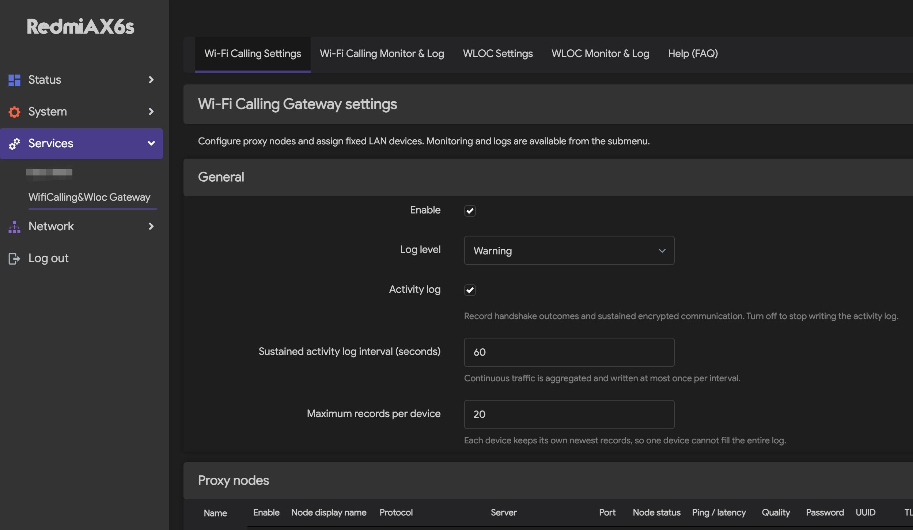

在“常规”区域：

1. 勾选“启用”。
2. 日志级别通常保持 `Warning`。
3. 如需观察握手和持续加密通讯，开启“活动日志”。
4. 持续活动日志间隔可保持 60 秒，每台设备最大记录数可保持 20 条。

## 3. 添加并保存代理节点

按照 FAQ 顺序，必须先保存节点，再添加设备策略。

1. 在“导入代理节点”中粘贴一条 AnyTLS、Hysteria2/Hy2、TUIC、VLESS、VMess、Trojan 或 WireGuard 分享链接；也可以点击“添加代理节点”手动填写。
2. 导入过程只在当前浏览器本地解析，不会把节点链接发送到外部服务。
3. 核对节点名称、服务器、端口、密码或 UUID、SNI、TLS 及协议专属字段。
4. 点击“保存并应用”。
5. 如设备策略的节点下拉框没有出现新节点，刷新页面后再继续。

## 4. 添加 iPhone 设备策略

在“设备策略”区域：

1. 点击“添加局域网设备”。
2. 填写容易识别的设备名称。
3. 路由模式选择“独立通道”。“跟随网关”不会使用插件节点。
4. 选择刚才保存的节点。
5. 填写 iPhone 当前使用的局域网 IPv4 地址。也可以使用下方的“从已连接设备选择”下拉框：插件会自动列出局域网内检测到的设备（来自 DHCP 租约和 ARP 缓存，显示设备名和真实 IP，已绑定和路由器自身除外），选择后设备名称和 IP 会自动填入。
6. 再次点击“保存并应用”。

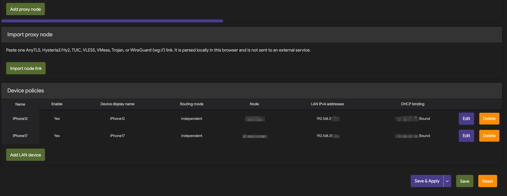

检查“DHCP 绑定”一栏：

- “已绑定”：可以继续。
- “待绑定”或“设备未在线”：确认 iPhone 已连接此路由器 Wi‑Fi。
- “MAC 已变化”：关闭再打开 iPhone Wi‑Fi，让插件根据当前租约自动重新绑定。

插件按 IP 识别设备。iPhone 实际地址与策略地址不一致时，流量不会进入所选节点。

## 5. 在 iPhone 开启 Wi‑Fi Calling

1. 打开 **设置 → 蜂窝网络**。
2. 选择要测试的 SIM 或号码。
3. 进入 **Wi‑Fi 通话**。
4. 开启“在此 iPhone 上进行 Wi‑Fi 通话”。

不同运营商和 iOS 版本的名称可能略有不同。如果没有此选项，应先向运营商确认 SIM、套餐和地区是否支持 Wi‑Fi Calling。

## 6. 查看 Wi‑Fi Calling 监控与日志

进入 **Wi‑Fi 通话监控与日志**。

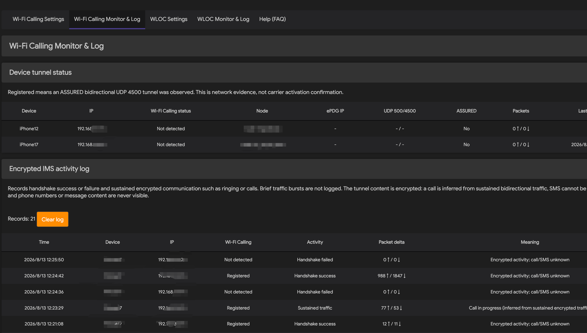

常见状态含义：

| 页面状态 | 路由器观察到的网络证据 |
|---|---|
| 未检测到 | 尚未观察到相关会话 |
| 正在协商 | 观察到 UDP 500 |
| NAT-T | 观察到 UDP 4500 |
| 已注册 | 双向 UDP 4500 已进入 `ASSURED` 状态 |
| 持续流量 | 注册后出现持续双向加密流量 |

“已注册”只是路由器侧网络证据，不是运营商激活确认。活动日志只能记录握手成功、握手失败和持续加密流量，无法读取号码、短信、语音内容或呼叫方向。

如果运营商要求位置与 SIM 归属地一致，此时可能仍显示“未检测到”。完成下面的 WLOC 配置后再等待几分钟并刷新此页面。

## 7. Wi‑Fi Calling 常见问题

### 一直显示“未检测到”

检查节点连通性、设备策略是否启用、路由模式是否为独立通道、节点是否正确、iPhone IP 与 DHCP 绑定是否一致，以及 iPhone 的 Wi‑Fi Calling 开关。

### 显示“已注册”，但不能通话

改用稳定的 TCP 系节点，确认节点国家与 SIM 归属地匹配，并向运营商确认号码已经开通。最终必须使用普通号码实际完成呼出和呼入测试。

### 飞行模式验证

可打开飞行模式，再单独开启 Wi‑Fi，观察状态栏是否出现运营商 Wi‑Fi Calling 标识。下图是 Wi‑Fi Calling Gateway 项目的 iPhone 实机记录：

# 第二部分：WLOC

## 8. WLOC 开始前检查

继续前确认：

1. 第一部分的代理节点和 iPhone 设备策略已经保存。
2. iPhone 正在使用该设备策略中的局域网 IP。
3. **关闭 Shadowrocket、Cloudflare WARP、Loon、WireGuard 和其他手机 VPN。** 手机 VPN 会绕过路由器重定向，使 WLOC 不生效。
4. iPhone 使用 Safari 下载证书描述文件。

当前项目的 WLOC 完全运行在路由器上，不需要 Cloudflare Worker、WLOC Plus 网站、TOKEN、Shadowrocket 模块或手机端 HTTPS 解密。

## 9. 从路由器获取 WLOC 证书

进入 **WLOC 设置**，向下找到“证书（Safari 安装）”区域。

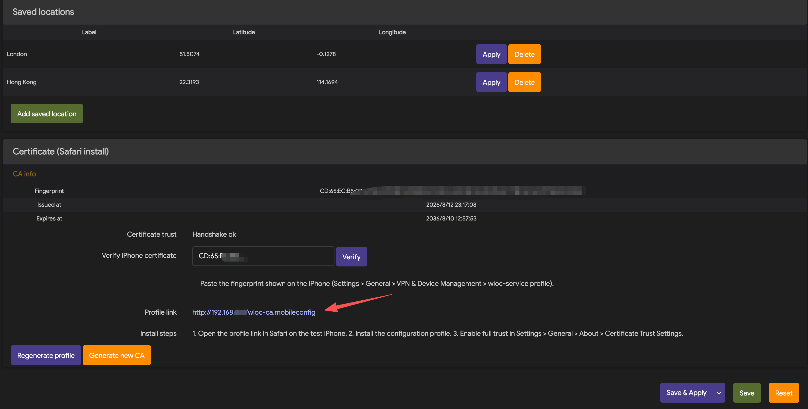

1. 查看 CA 指纹、签发时间、过期时间和证书状态。
2. 点击页面显示的“配置文件链接”。链接地址自动使用当前路由器的局域网 IP（例如网关 `192.168.31.1` 时显示 `http://192.168.31.1/wloc-ca.mobileconfig`，网关为 `192.168.1.1` 时自动变为 `http://192.168.1.1/wloc-ca.mobileconfig`），无需手动修改。
3. “重新生成配置文件”只重新导出描述文件。
4. 不要随意点击“生成新 CA”。生成新 CA 后，原来安装在 iPhone 上的证书将失效，所有测试设备都要重新安装并信任新证书。

## 10. 在 iPhone 下载并安装描述文件

### 10.1 在 Safari 打开配置文件地址

在测试 iPhone 的 Safari 地址栏输入 WLOC 设置页面显示的完整链接。

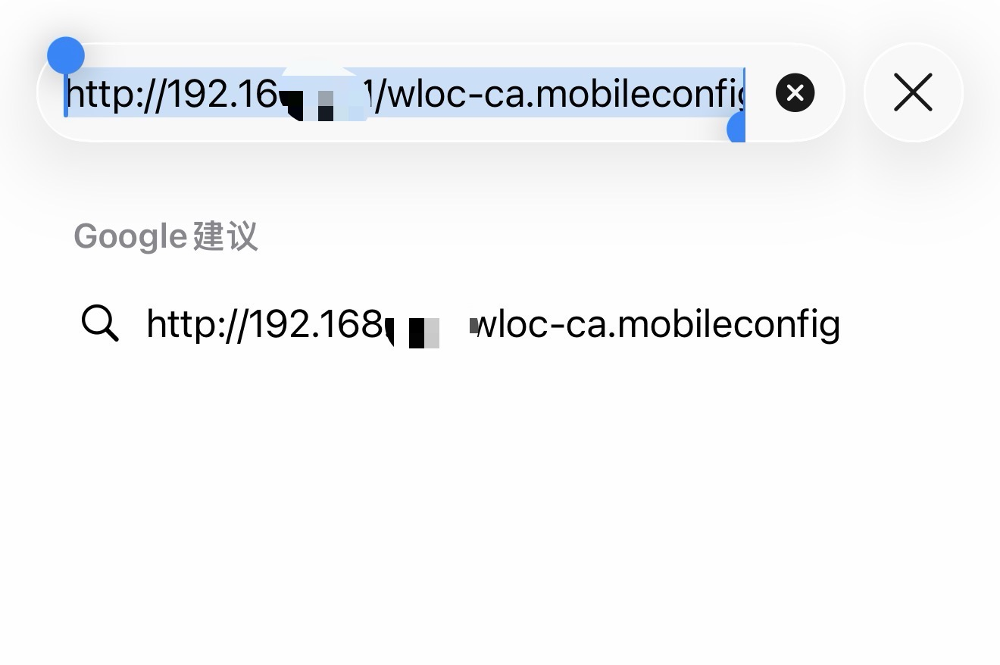

### 10.2 允许下载

Safari 提示“此网站正尝试下载一个配置描述文件”时，点击“允许”。

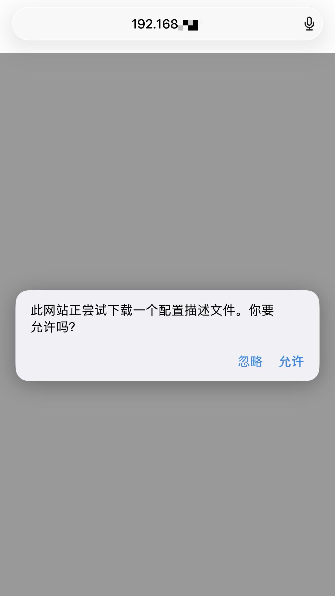

### 10.3 打开已下载描述文件

下载完成后打开 iPhone“设置”，点击顶部的“已下载描述文件”。如果没有出现此入口，可进入 **设置 → 通用 → VPN 与设备管理**。

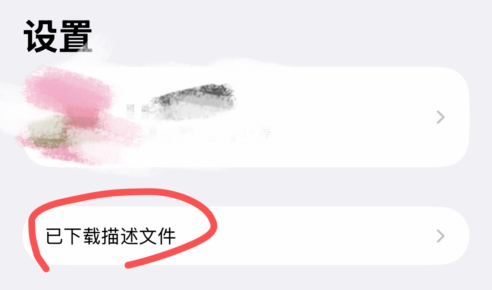

### 10.4 安装 wloc-service root CA

确认描述文件名称和签名者均为 `wloc-service root CA`，然后点击右上角“安装”，按系统提示完成安装。

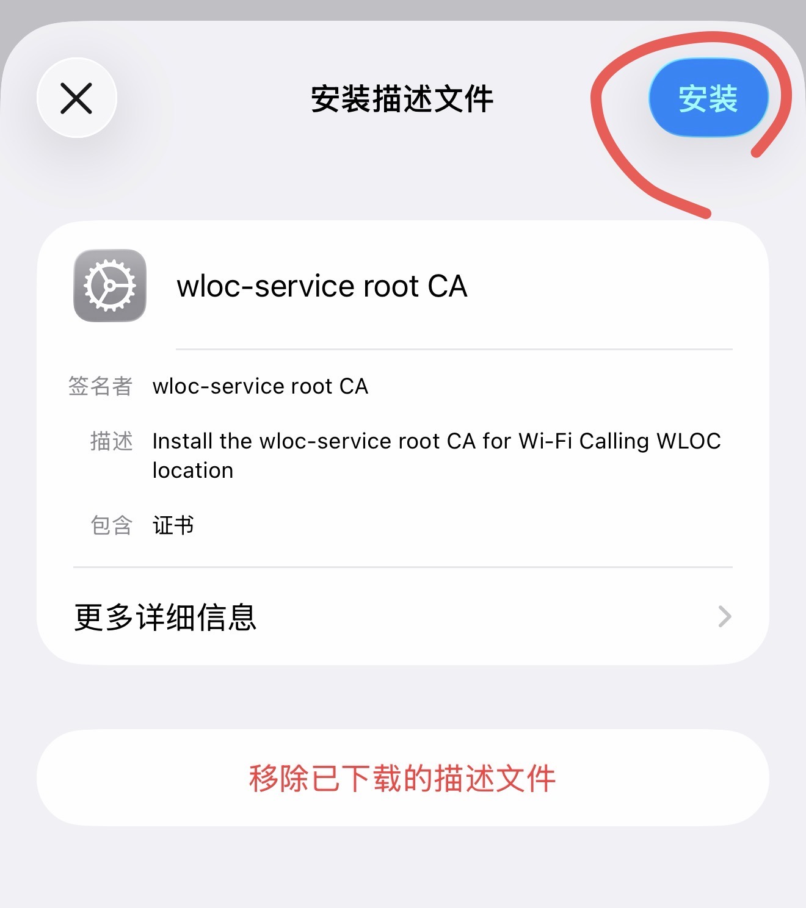

## 11. 在 iPhone 开启证书完全信任

安装描述文件后，还必须执行：

1. 进入 **设置 → 通用 → 关于本机 → 证书信任设置**。
2. 找到 `wloc-service root CA`。
3. 打开右侧的完全信任开关，并确认系统提示。

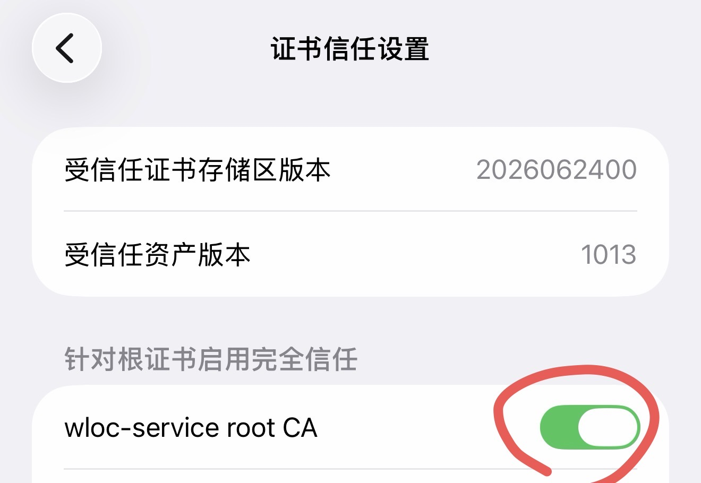

返回路由器 WLOC 设置页面后，可以把 iPhone 描述文件中显示的指纹粘贴到“验证 iPhone 证书”，点击“验证”，确认与路由器 CA 指纹一致。

## 12. 设置 WLOC 自动或手动位置

回到 **WLOC 设置**页面。

### 12.1 选择跟随设备

在“跟随设备”中选择第一部分已经配置好的测试 iPhone。自动模式会跟随该设备绑定节点的出口位置。

### 12.2 自动模式

1. 将“定位模式”设为“自动（跟随节点）”。
2. 确认“跟随设备”正确。
3. 打开“启用 WLOC 拦截”。
4. 点击“保存并应用”。

自动模式使用节点出口 IP 的国家、城市、时区和坐标。更换设备绑定节点后，等待服务重新探测出口并更新目标。

### 12.3 手动模式

1. 在“地点名称”中输入地点，例如 `London, UK`，点击“搜索”。
2. 搜索只会返回结果，不会立即修改位置。
3. 确认纬度和经度后，点击“应用坐标”。
4. 也可以直接输入纬度和经度，再点击“应用坐标”。
5. 已保存的位置可以一键“应用”；点击“添加保存位置”可创建新的预设。
6. 最后点击“保存并应用”。

手动坐标和预设保存在路由器 `/etc/config/wloc-service` 中，重启后仍然保留。GPS 数值只保存在路由器本地管理面。

## 13. 在 iPhone 重新触发定位

切换模式或更换位置后，按 FAQ 建议执行以下任意一种操作：

1. 开关一次飞行模式；或
2. 关闭再打开 Wi‑Fi；或
3. 强制退出地图、天气等应用后重新打开。

定位请求由 iPhone 应用触发，Apple 定位服务也可能存在缓存。如果第一次未刷新，稍等片刻后再触发一次。

## 14. 查看 WLOC 监控与日志

进入 **WLOC 监控与日志**。

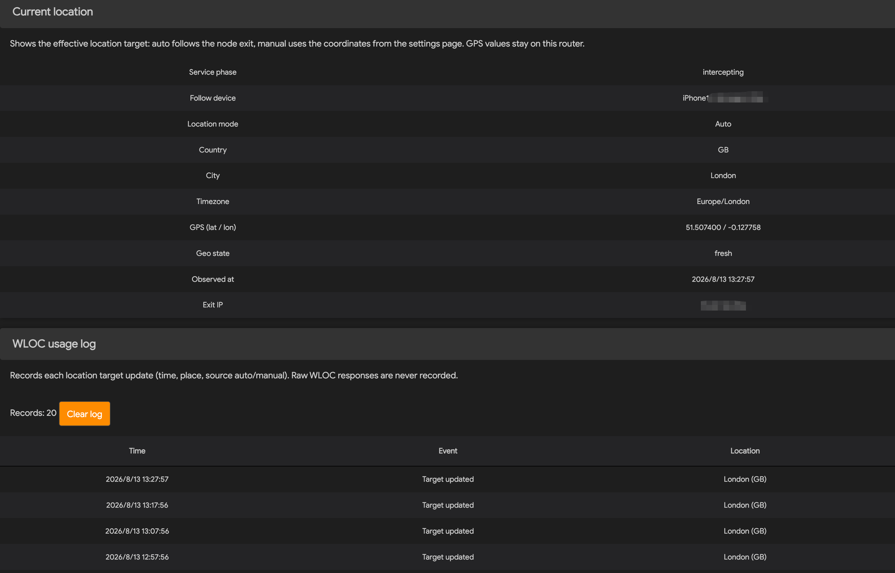

检查以下项目：

- `Service phase` 为 `intercepting`。
- `Follow device` 是当前测试 iPhone。旁边的“刷新 IP”按钮可立即重新探测跟随节点的出口 IP。
- 在 Wi‑Fi 通话设置中切换设备的节点后，监控页出口 IP 约 10 秒内自动跟随新节点；需要立即生效时点击“刷新 IP”。
- `Location mode` 与自动或手动模式一致。
- 国家、城市、时区和 GPS 坐标符合目标。
- `Geo state` 为 `fresh`。
- WLOC 使用日志出现“定位目标更新”。

WLOC 使用日志最多保留最近 20 条，可点击“清空日志”。日志只记录目标更新时间、地点和自动/手动来源，不记录原始 WLOC 响应。

“定位目标更新”只说明路由器已经更新目标，不能证明真实 GPS、基站位置或运营商紧急地址已经改变。

## 15. WLOC 常见问题

### WLOC 完全没有变化

确认描述文件已安装、`wloc-service root CA` 已开启完全信任、WLOC 拦截已开启、跟随设备正确，并关闭手机上的所有 VPN。然后重新触发地图或天气定位。

### 自动位置与节点不一致

确认第一部分的设备策略绑定了预期节点，Passwall 等全局代理已绕过测试设备，手机没有运行其他 VPN。切换节点后监控页出口 IP 约 10 秒内自动跟随，也可点击“刷新 IP”立即重新探测；`Geo state` 更新为 `fresh` 后即可。

### 证书验证失败

比较 iPhone 描述文件与路由器页面显示的 CA 指纹。如果不一致，删除 iPhone 上的旧描述文件，重新从当前路由器下载、安装并开启完全信任。

### 如何恢复原始位置

在 WLOC 设置中关闭“启用 WLOC 拦截”，点击“保存并应用”。需要彻底退出测试时，再到 iPhone 删除 WLOC 描述文件并关闭对应根证书信任。

## 16. 最终检查

WLOC 状态正确后，返回 **Wi‑Fi 通话监控与日志**，等待几分钟。页面出现“已注册”后，使用普通号码完成一次呼出和一次呼入测试。

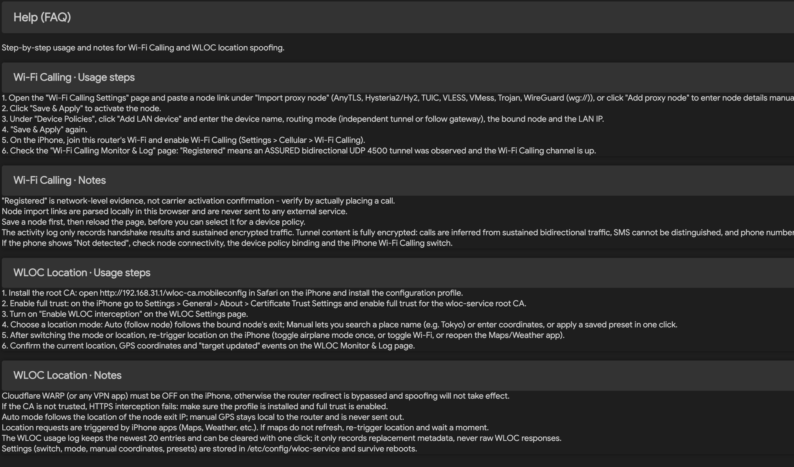

## 17. 安全与隐私

- 不要公开节点链接、密码、UUID、私钥、CA 私钥或完整证书指纹。
- 不要把真实设备标识、原始流量或精确个人位置提交到 GitHub。
- 只在专用测试 iPhone 上信任 WLOC CA，测试结束后删除。
- WLOC 只应处理指定设备的 Apple WLOC 请求，普通 HTTPS 网站不应出现 wloc-service 签发的证书。
- 遵守当地法律、Apple 条款和运营商条款，紧急服务始终使用真实位置。

## 资料来源

- [Wi‑Fi Calling Gateway 中文 README](https://github.com/smthdagg/luci-app-wificalling-gateway/blob/main/README.md)
- 本项目当前 LuCI 页面、内置 FAQ 和 AX6S 实机验证记录
