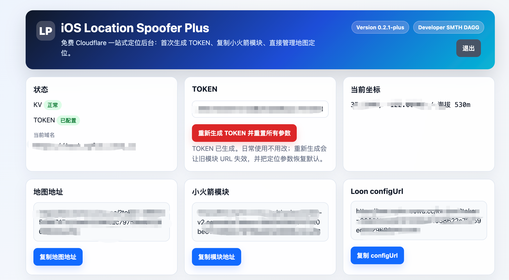

# Wi‑Fi Calling Gateway + WLOC 教程 / Tutorial

本文件分为两个完全独立的部分：先阅读中文版，再阅读英文版。流程适用于 Redmi AX6S、ImmortalWrt/OpenWrt 24.10、Wi‑Fi Calling Gateway 1.7 与独立的 WLOC 服务。

---

# 中文版：Wi‑Fi Calling Gateway + WLOC

## 1. 目标与工作范围

本方案在同一台 OpenWrt 路由器上提供两个相互隔离的功能：

- Wi‑Fi Calling Gateway 1.7：为指定 iPhone 转发 Wi‑Fi Calling 的 UDP 500/4500，并观察 ePDG 隧道证据。
- WLOC：仅为指定 iPhone、`gs-loc.apple.com` 和 `gs-loc-cn.apple.com` 的 TCP 443 请求提供经验证的网络定位响应。

WLOC 不修改手机 GPS，不控制基站定位，也不证明运营商已激活 Wi‑Fi Calling。WLOC 规则使用独立的 nftables 范围，不修改 Gateway 1.7 的 IPsec/Wi‑Fi Calling 表。

## 2. 准备工作

- Redmi AX6S 或兼容的 AArch64 OpenWrt 路由器。
- ImmortalWrt/OpenWrt 24.10、已安装 Wi‑Fi Calling Gateway 1.7 和 sing-box。
- 一台专用测试 iPhone，并在 DHCP 中固定其 LAN 地址。
- 构建机具备 Git、Rust 1.90、Docker 及 OpenWrt 交叉构建环境。
- 专用测试时间窗和可回滚的配置备份。

不要在个人主力手机上安装测试 CA；不要用虚拟定位进行紧急呼叫测试。

## 3. iPhone 设置（必须先完成）

### 3.1 连接路由器 Wi‑Fi

在 iPhone 打开“设置 → Wi‑Fi”，连接 AX6S 的 SSID。确认手机获得的 LAN 地址与 Gateway/WLOC 中绑定的设备一致。测试期间保持连接到该 SSID，不要在蜂窝数据和多个 VPN 之间切换。

### 3.2 打开 Wi‑Fi Calling

打开“设置 → 蜂窝网络 → Wi‑Fi 通话”，启用“在此 iPhone 上进行 Wi‑Fi 通话”。不同运营商可能显示不同文案；如果没有该选项，先确认 SIM、运营商和地区支持。

### 3.3 安装并信任 WLOC 测试 CA

1. 使用 Safari 打开路由器提供的 CA 配置文件地址，例如 `http://<路由器地址>/wloc-ca.mobileconfig`。
2. 按系统提示下载配置描述文件，然后在“设置 → 通用 → VPN 与设备管理”中安装。
3. 前往“设置 → 通用 → 关于本机 → 证书信任设置”，为 WLOC service root CA 开启“完全信任”。
4. 只在专用测试 iPhone 上执行；测试完成后删除描述文件并关闭信任。

### 3.4 关闭会绕过路由器的 VPN

在“设置 → VPN”或“设置 → 通用 → VPN 与设备管理”中，关闭 Cloudflare WARP、Shadowrocket、Loon、WireGuard 以及其他 VPN/代理。手机 VPN 会绕过路由器的 WLOC 重定向，也可能使 Wi‑Fi Calling 的 TPROXY 路径失效。

### 3.5 触发定位刷新

修改目标位置后，打开“地图”或“天气”触发新的网络定位请求；如果没有更新，可依次关闭并重新打开应用、切换一次飞行模式，或关闭再打开 Wi‑Fi。WLOC 网络定位不会替代“设置 → 隐私与安全性 → 定位服务”中的 GPS 权限。

## 4. 构建与安装网关服务

在 WLOC 项目目录构建，不要修改稳定的 Gateway 1.7 源码仓库：

```sh
OPENWRT_BIN_NAME=wloc-service \
OPENWRT_CROSS_CACHE_DIR=/tmp/wloc-rust-openwrt-deploy \
./scripts/ci/verify-rust-openwrt.sh
```

将构建产物和配置骨架复制到路由器：

```sh
scp /tmp/wloc-rust-openwrt-deploy/output/wloc-service root@AX6S:/usr/sbin/
scp openwrt/files/etc/init.d/wloc-service root@AX6S:/etc/init.d/
scp openwrt/files/etc/config/wloc-service root@AX6S:/etc/config/
ssh root@AX6S 'chmod 0755 /usr/sbin/wloc-service /etc/init.d/wloc-service'
```

如果使用 IPK：

```sh
opkg install ./wloc-service_*.ipk ./wloc-ctl_*.ipk
/etc/init.d/wloc-service enable
/etc/init.d/wloc-service start
```

## 5. 配置 Wi‑Fi Calling Gateway

进入 LuCI 的“Services → WifiCalling&Wloc Gateway → Wi‑Fi Calling Settings”。


1. 启用 Gateway，选择日志级别，并按需要设置活动日志间隔和每台设备的最大记录数。
2. 添加 AnyTLS、Hysteria2/Hy2、TUIC、VLESS、VMess、Trojan 或 WireGuard 节点；链接在浏览器本地解析，不上传到外部服务。
3. 在“Device policies”中添加测试 iPhone，填写稳定的 LAN 地址、绑定节点和路由模式。
4. 点击“Save & Apply”。


## 6. 配置 WLOC 目标位置

进入“WLOC Settings”。首次测试建议保持默认关闭，确认设备和 CA 流程无误后再启用。


- “Auto (follow node)”根据该设备绑定节点的出口位置选择目标。
- “Manual”允许输入纬度/经度，或通过地点搜索选择位置。
- 目标位置变更后，重新触发 iPhone 的地图/天气请求。
- 服务异常、证书不受信或 Geo 数据无效时，WLOC 必须转发原始响应，不得生成默认坐标。

### WLOC Plus 截图的使用边界

以下图片来自 WLOC Plus 的网页控制台，只用于说明地图选点、保存位置和客户端模块的交互概念；它们不是 iOS 原生“设置”截图，也不是本项目的必需组件。不要把 WLOC Plus 的 TOKEN、ConfigURL 或模块 URL 粘贴到 Wificalling+WLOC。




## 7. 验证 Wi‑Fi Calling

进入“Wi‑Fi Calling Monitor & Log”。“Registered”只表示观察到双向 UDP 4500 ASSURED 隧道，是网络证据，不是运营商激活确认。


建议顺序：观察 UDP 500/4500 → 等待 ASSURED → 检查 ePDG IP → 实际进行一次普通呼出/呼入测试。日志只记录握手和持续加密流量的元数据，不记录号码、短信或通话内容。

## 8. 验证 WLOC

进入“WLOC Monitor & Log”，检查 service phase、设备、目标国家/城市、GPS 坐标、Geo state、更新时间和 exit IP。看到“target updated”只表示目标配置已更新；不能表述为手机 GPS 已被控制。


验收至少包括：两台设备不串位、错误 token/Worker 离线时不返回默认坐标、关闭 WLOC 后原始请求正常通过、关闭 iPhone VPN 后规则才生效、Gateway UDP 500/4500 始终不被 WLOC 拦截。

## 9. 故障排查

- **未检测到 Wi‑Fi Calling**：检查 iPhone 是否连接正确 SSID、Wi‑Fi Calling 是否开启、设备 LAN 地址是否匹配、节点是否可达。
- **WLOC 无更新**：检查 CA 是否安装并完全信任、WARP/其他 VPN 是否关闭，然后重新打开地图/天气。
- **证书错误**：确认只安装本路由器生成的测试 CA，且 hostname 为允许的 Apple WLOC 域名。
- **服务异常**：关闭 WLOC interception；应自动撤销独立重定向并恢复原始流量。不要手工修改 Gateway 1.7 nftables 表。

## 10. 安全与合规

仅在获授权的测试设备和网络上使用。CA 私钥、节点凭据、原始 WLOC 响应、设备标识和精确位置不得提交到 Git 或支持包。虚拟位置可能改变应用和运营商对位置的判断；紧急呼叫必须使用真实位置并遵守当地法律、运营商条款和 Apple 条款。测试结束后卸载 CA、关闭 WLOC，并恢复备份配置。

---

# English: Wi‑Fi Calling Gateway + WLOC

## 1. Goal and scope

This setup provides two isolated functions on one OpenWrt router:

- Wi‑Fi Calling Gateway 1.7 forwards UDP 500/4500 for the assigned iPhone and reports ePDG tunnel evidence.
- WLOC handles only TCP 443 requests from the assigned iPhone to `gs-loc.apple.com` and `gs-loc-cn.apple.com`, returning a verified network-location response.

WLOC does not control GPS, cellular positioning, or carrier activation. Its nftables rules are separate from the Gateway 1.7 IPsec/Wi‑Fi Calling table.

## 2. Prerequisites

- Redmi AX6S or another AArch64 OpenWrt router.
- ImmortalWrt/OpenWrt 24.10 with Wi‑Fi Calling Gateway 1.7 and sing-box installed.
- A dedicated test iPhone with a stable DHCP reservation.
- Git, Rust 1.90, Docker, and the OpenWrt cross-build environment.
- A rollback backup and an authorized test window.

Never install a test CA on a personal primary phone, and never place an emergency call while location spoofing is enabled.

## 3. iPhone setup (complete this first)

### 3.1 Join the router Wi‑Fi

Open **Settings → Wi‑Fi** and join the AX6S SSID. Confirm that the address shown for the iPhone matches the device binding in Gateway/WLOC. Keep the phone on this SSID during testing and avoid switching between cellular data and multiple VPNs.

### 3.2 Enable Wi‑Fi Calling

Open **Settings → Cellular → Wi‑Fi Calling** and enable **Wi‑Fi Calling on This iPhone**. Wording varies by carrier and region; if the option is missing, verify SIM, carrier, and regional support.

### 3.3 Install and trust the WLOC test CA

1. In Safari, open the router-provided profile URL, for example `http://<router-address>/wloc-ca.mobileconfig`.
2. Install the downloaded profile under **Settings → General → VPN & Device Management**.
3. Go to **Settings → General → About → Certificate Trust Settings** and enable full trust for the WLOC service root CA.
4. Use this only on the dedicated lab iPhone. Remove the profile and trust after testing.

### 3.4 Disable VPNs that bypass the router

Under **Settings → VPN** or **Settings → General → VPN & Device Management**, disable Cloudflare WARP, Shadowrocket, Loon, WireGuard, and any other VPN or proxy. A device VPN can bypass the router redirect and can also interfere with the Gateway TPROXY path.

### 3.5 Trigger a location refresh

After changing the target, open Maps or Weather to trigger a new network-location request. If it does not refresh, force-close and reopen the app, toggle Airplane Mode once, or toggle Wi‑Fi. WLOC does not replace GPS permissions under **Settings → Privacy & Security → Location Services**.

## 4. Build and install the gateway service

Build from the WLOC project checkout, without modifying the stable Gateway 1.7 source tree:

```sh
OPENWRT_BIN_NAME=wloc-service \
OPENWRT_CROSS_CACHE_DIR=/tmp/wloc-rust-openwrt-deploy \
./scripts/ci/verify-rust-openwrt.sh
```

Copy the binary and configuration skeleton:

```sh
scp /tmp/wloc-rust-openwrt-deploy/output/wloc-service root@AX6S:/usr/sbin/
scp openwrt/files/etc/init.d/wloc-service root@AX6S:/etc/init.d/
scp openwrt/files/etc/config/wloc-service root@AX6S:/etc/config/
ssh root@AX6S 'chmod 0755 /usr/sbin/wloc-service /etc/init.d/wloc-service'
```

For IPK installation:

```sh
opkg install ./wloc-service_*.ipk ./wloc-ctl_*.ipk
/etc/init.d/wloc-service enable
/etc/init.d/wloc-service start
```

## 5. Configure Wi‑Fi Calling Gateway

Open **Services → WifiCalling&Wloc Gateway → Wi‑Fi Calling Settings**.


1. Enable the gateway, choose the log level, and set activity interval and per-device record limits.
2. Add an AnyTLS, Hysteria2/Hy2, TUIC, VLESS, VMess, Trojan, or WireGuard node. Links are parsed locally in the browser and are not uploaded.
3. Under **Device policies**, add the test iPhone with its stable LAN address, bound node, and routing mode.
4. Select **Save & Apply**.


## 6. Configure the WLOC target

Open **WLOC Settings**. Keep interception disabled during initial setup, then enable it after the device and CA workflow are confirmed.


- **Auto (follow node)** follows the exit location of the node bound to the device.
- **Manual** accepts coordinates or a searched place.
- Trigger a new Maps/Weather request after changing the target.
- On service, certificate, or Geo failure, WLOC must forward the original response and must never invent a default coordinate.

### WLOC Plus screenshot boundary

The following images are WLOC Plus web-console references for map selection, saved locations, and client-module concepts. They are not native iOS Settings screenshots and are not required components of this project. Do not copy a WLOC Plus TOKEN, ConfigURL, or module URL into Wificalling+WLOC.


## 7. Verify Wi‑Fi Calling

Open **Wi‑Fi Calling Monitor & Log**. **Registered** means that a bidirectional ASSURED UDP 4500 tunnel was observed; it is network evidence, not carrier activation confirmation.


Check UDP 500/4500, then ASSURED, then the ePDG address, and finally place a normal authorized test call. Logs contain handshake and encrypted-traffic metadata only; they do not contain phone numbers, SMS, or call content.

## 8. Verify WLOC

Open **WLOC Monitor & Log** and check service phase, device, target country/city, coordinates, Geo state, update time, and exit IP. **target updated** means that the target configuration changed; it does not prove that the iPhone GPS was controlled.


Acceptance must include device isolation, no default coordinate on invalid credentials or provider outage, pass-through after interception is disabled, successful refresh with device VPNs off, and no WLOC interception of Gateway UDP 500/4500.

## 9. Troubleshooting

- **Wi‑Fi Calling not detected:** verify the SSID, Wi‑Fi Calling switch, stable device address, and node reachability.
- **WLOC does not update:** verify CA installation and full trust, disable WARP/other VPNs, and reopen Maps or Weather.
- **Certificate error:** use only the router-generated lab CA and the two allow-listed Apple hostnames.
- **Service failure:** disable WLOC interception; the independent redirect should be removed and original traffic restored. Do not edit the Gateway 1.7 nftables table manually.

## 10. Security and compliance

Use this only on authorized test devices and networks. Never commit CA private keys, node credentials, raw WLOC responses, device identifiers, or precise locations. A spoofed location can change app and carrier decisions; emergency calls must use the real location and comply with local law, carrier terms, and Apple terms. Remove the CA, disable WLOC, and restore the backup when testing is complete.

## Related documents

- [`docs/deployment/AX6S_DEPLOYMENT.md`](deployment/AX6S_DEPLOYMENT.md)
- [`docs/ui/INTEGRATION_UI.md`](ui/INTEGRATION_UI.md)
- [`docs/security/WLOC_THREAT_MODEL.md`](security/WLOC_THREAT_MODEL.md)
