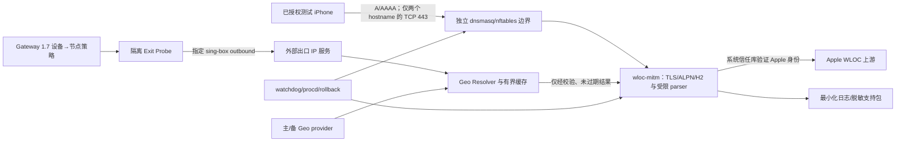

# WLOC PoC 威胁模型（历史基线）

> 本文保留为 Phase 0 历史安全证据。当前独立仓库产品以
> `docs/adr/0004-integrated-gateway-wloc-product-boundary.md` 和
> `DEVELOPMENT_TEST_PLAN.md` 的 V2 附录为准；当前产品同时包含 Gateway 与
> WLOC，但不依赖、读取或管理外部 Gateway 1.7 项目。

- Status: Historical Phase 0 baseline; the V2 implementation is covered by
  the current Rust/OpenWrt tests and the redacted AX6S release evidence.
  Real client WLOC traffic remains untested without an authorized fixture.
状态：**Phase 0 历史基线；V2 实现已有当前 Rust/OpenWrt 测试和 AX6S 脱敏证据覆盖，未提供授权 fixture 时不进行真实客户端 WLOC 流量测试**
评审记录：[Phase 0 review](../reviews/PHASE0_OFFLINE_SCAFFOLD_REVIEW.md)  
适用范围：最多 8 个设备档案、明确授权的 LAN、Redmi AX6S/OpenWrt、独立
`wloc_service` 与 `wloc_profile_<id>` 数据面，以及两个精确目标
`gs-loc.apple.com` 和 `gs-loc-cn.apple.com`。每个档案只绑定一个私有 IPv4。  
不适用范围：生产部署、无界多设备、全局 HTTPS 代理、运营商激活判断、GPS 替代、紧急呼叫位置保证。

本文只定义安全边界、失效行为和验证证据。它不描述、猜测或批准任何 Apple 私有协议字段；parser/patch 的语义只能来自已授权、脱敏且经评审的 fixture 与协议笔记。

## 1. 安全目标与判定原则

PoC 的首要目标不是“始终返回修改后的位置”，而是把一次有意的 TLS MITM 限制在最小授权范围内，并保证失败可见、可恢复、不会扩大拦截面。

必须始终成立：

- 只有设备档案绑定的私有 IPv4 访问两个精确 allowlist hostname 的 TCP 443 流量可进入 MITM；最多 8 个档案分别受界限约束。
- 普通 HTTPS、其他 LAN 设备、路由器管理面、sing-box 管理/健康检查以及 UDP 500/4500 不进入 WLOC 路径。
- Apple 上游身份验证失败时不得关闭证书验证、接受未知 CA 或生成位置。
- Geo 数据不可靠、协议未知或 parser/patch 失败时不得产生默认假坐标；能安全返回未经修改的已验证上游响应时才透传。
- 引擎不可用时，专用 redirect 必须被撤销，不能持续形成黑洞。
- CA 私钥、节点凭据、原始 WLOC 正文、设备标识和精确位置不得进入日志、支持包、Git 或 CI artifact。
- PoC 默认关闭；启用、停止、回滚和撤销 CA 信任都有明确且可验证的操作。

## 2. 资产

| 资产 | 安全属性 | 失陷影响 |
|---|---|---|
| 测试 iPhone 的通信与定位输入 | 机密性、完整性、可用性 | 流量泄露、错误定位、服务中断 |
| 路由器本地专用 CA 私钥与 leaf 私钥 | 最高机密性、完整性 | 可伪造受信 TLS 身份；必须视为严重失陷 |
| Apple 上游 TLS 会话与响应 | 身份真实性、完整性、时效性 | 接受攻击者响应或向设备注入错误数据 |
| sing-box 节点凭据和运行配置 | 机密性、完整性、可用性 | 节点滥用、出口判断错误、现有 Gateway 受损 |
| 出口 IP 与 Geo 缓存 | 完整性、时效性、最小披露 | 错误城市/坐标，泄露网络使用信息 |
| 独立 nftables/dnsmasq 状态 | 完整性、可用性、隔离性 | 拦截范围扩大、IPv6 绕过、流量黑洞 |
| Gateway 1.7 稳定数据面 | 完整性、可用性 | Wi-Fi Calling 注册/通话中断 |
| 日志、支持包、CI artifact | 机密性、可审计性 | 凭据、设备或位置数据被二次泄露 |
| 授权 fixture 与协议笔记 | 来源可追溯、脱敏、完整性 | 隐私/许可违规或实现建立在伪造证据上 |

## 3. 系统与信任边界

主要信任边界：

1. **设备到路由器**：测试设备受专用 CA 信任影响；同 LAN 的其他设备和攻击者均不可信。
2. **透明重定向边界**：域名经 DNS 得到的 A/AAAA 地址会变化、复用或被污染；仅凭目标 IP 不能证明 TLS hostname。
3. **MITM 到 Apple 上游**：公网、DNS、代理出口和 sing-box 节点均不可信；上游身份必须独立验证。
4. **Gateway/sing-box 到实验组件**：只读取或导出完成任务所需的最小节点材料；不得改写运行中的生产 sing-box 配置。
5. **Geo provider 边界**：外部响应不可信，且城市级 IP Geo 天生不精确。
6. **持久化与运维边界**：root、LuCI、备份、日志、支持包和 CI 的可见范围不同；秘密不能因便利而跨界。

## 4. 攻击者与能力假设

- 同一 LAN 上可发包、伪造源地址或诱导 DNS 的非授权客户端。
- 能控制或污染本地 DNS、上游网络、代理节点、出口 IP 服务或 Geo provider 的网络攻击者。
- 提供畸形、大体积、高压缩比或高并发响应的恶意/异常上游。
- 能访问 LuCI、备份、日志或支持包但不应获得 CA/节点秘密的低权限运维者。
- 获得路由器 root 的攻击者。PoC 无法在 root 完全失陷后保护路由器内秘密，但必须避免把影响扩散到 Git、CI、其他设备或长期备份。
- 配置错误、过期缓存、进程崩溃、存储耗尽和 IPv4/IPv6 分裂也按对抗性故障处理。

不假设 Apple、Geo provider 或代理节点永远正确；也不假设域名永远保持固定地址或协议形态。

## 5. 风险分级

| 严重度 | 含义 |
|---|---|
| Critical | 可扩大 TLS 拦截范围、泄露 CA/节点秘密、长期破坏 Gateway/紧急通信路径，或使未授权设备受影响 |
| High | 可注入错误位置、绕过上游验证、造成持久黑洞、泄露敏感定位/设备数据或稳定耗尽路由器资源 |
| Medium | 影响有限范围的可用性、审计真实性或粗粒度隐私，且可通过停止/回滚恢复 |
| Low | 不改变安全边界的诊断或短暂体验问题 |

严重度按当前单设备 PoC 评估；若扩大设备数、hostname、持久安装范围或远程管理面，必须重新建模。

## 6. 威胁登记表（STRIDE）

“验证证据”是进入对应阶段前必须产出的证据，不表示当前已经通过。

| ID / STRIDE | 威胁与严重度 | 必须控制 | 验证证据 |
|---|---|---|---|
| S-01 / Spoofing | **Critical**：伪造 Apple 上游，诱使引擎接受攻击者证书或响应 | 使用系统/固定受控信任库验证完整链、有效期和请求 hostname；禁止 `InsecureSkipVerify`、自签回退和证书错误重试降级 | 无效链、过期、hostname 不匹配、未知 CA 测试均受控失败；代码/配置扫描证明无跳过验证 |
| S-02 / Spoofing | **High**：伪造测试设备源地址进入 redirect | 单设备 lease 绑定固定地址与可用的二层身份；仅在受控测试 LAN 启用；记录 DHCP 变更并默认禁用不一致绑定 | 非测试设备、源地址伪造、DHCP 地址变化测试不进入 MITM；规则快照 |
| S-03 / Spoofing | **High**：DNS 污染或共享 CDN IP 把非目标域流量导入候选集合 | dnsmasq 只维护两个精确域名的 A/AAAA set；MITM 再以 TLS SNI/目标 hostname 做二次 allowlist；非 allowlist 不签发 leaf、不代理 | DNS 地址变化、共享 IP、无 SNI/错误 SNI、普通 HTTPS 负向测试 |
| T-01 / Tampering | **Critical**：修改外部 nft table 或 sing-box 运行配置导致现网行为改变 | 只使用独立 `wloc_service` 与 `wloc_profile_<id>` table/chain；Exit Probe 使用隔离临时 outbound；外部配置只读；安装/卸载有差异检查 | 启停前后外部 nft/config 哈希与规则语义一致；UDP 500/4500 未命中 WLOC 计数器 |
| T-02 / Tampering | **High**：未知/畸形协议被错误修改，或非目标字段受损 | 只处理已授权 fixture 覆盖并冻结的结构；未知、畸形、截断或不支持版本不 patch；保留未知字段；禁止默认坐标 | fixture 来源审批；round-trip/未知字段/字段顺序/截断/非目标消息测试；fuzz 无崩溃 |
| T-03 / Tampering | **High**：Geo provider、缓存或时钟污染产生错误位置 | 严格 schema/range/timezone 校验；主备冲突标记 `geo_uncertain`；缓存绑定 `node_id + exit_ip` 并设 TTL；时钟异常不延长可信期 | 坏 JSON、越界、冲突、回拨时钟、过期、exit IP 变化测试均不生成新位置 |
| T-04 / Tampering | **High**：Exit Probe 实际走 WAN 或错误节点 | 探测必须经指定 sing-box outbound；验证结果不是 WAN IP；节点材料最小化且临时文件清理 | WAN/代理出口对照、错误凭据、DNS、节点黑洞测试；无残留凭据 |
| R-01 / Repudiation | **Medium**：无法证明何时启用、范围或为何 fail-open | 记录不含秘密的状态转换、规则代次、健康状态和错误类别；使用单调事件序号/时间；不把日志当成协议证据 | 启用/停止/崩溃/回滚事件测试；状态与 nft 快照可关联；日志轮转测试 |
| I-01 / Disclosure | **Critical**：CA 私钥或 leaf 私钥出现在 LuCI、备份、日志、支持包、Git/CI | 仅路由器本地生成；root:root、`0600`；公钥证书单独导出；普通备份和支持包显式排除私钥；秘密扫描 | 权限测试；支持包/备份解包负向扫描；仓库与 CI artifact 扫描；LuCI 仅显示证书和 SHA-256 指纹 |
| I-02 / Disclosure | **Critical**：sing-box UUID、密码、私钥、分享链接或 provider token 泄露 | 仅进程内/受限临时文件传递最小节点配置；错误与命令行不回显；退出清理 | `/proc`/日志/临时目录/支持包扫描；异常退出清理测试 |
| I-03 / Disclosure | **High**：原始 WLOC 正文、BSSID/cell、设备地址或精确坐标被记录 | 禁止 body dump；日志 allowlist 仅事件、精确 hostname、结果、字节数、粗粒度国家/城市、加盐/轮换后的设备假名；总量 ≤1MB | 日志和支持包自动脱敏测试；失败路径和 debug 模式同样验证 |
| D-01 / DoS | **High**：大 body、压缩炸弹、畸形 protobuf 或递归/重复字段耗尽内存/CPU | 在读取前后分别限制 wire body、解压后 body、倍率、单次分配、字段/嵌套/循环工作量；超限不解析、不缓存、不记录正文 | oversized、gzip bomb、深度/重复字段、截断 fuzz；峰值 RSS/CPU/耗时证据 |
| D-02 / DoS | **High**：HTTP/2 多 stream、慢速连接或握手风暴耗尽 AX6S | 限制总连接、单设备连接、H2 concurrent streams、header/body、握手/读取/上游/空闲超时；有界队列；拒绝额外设备 | 并发/slowloris/RST/GOAWAY/超时压力测试；运行内存保持 15–25MB 目标内 |
| D-03 / DoS | **Critical**：引擎崩溃但 redirect 留存，WLOC 或更广流量长期黑洞 | watchdog 以引擎健康为前置条件安装/保留规则；故障先原子撤销 redirect，再重启；限制 respawn；重启默认清理 PoC 状态 | `kill -9`、OOM、启动失败、反复崩溃、路由器重启测试；在限定恢复时间内规则消失且普通网络恢复 |
| D-04 / DoS | **High**：IPv6/AAAA 绕过 MITM或形成 v4/v6 分裂、黑洞 | 真机前书面选择完整 v6 路径或仅测试设备+两个域名的 AAAA 精确抑制；不得全局禁 IPv6；A/AAAA TTL 与删除同步 | 双栈、仅 v6、地址轮换、dnsmasq reload、普通 IPv6 和其他设备负向测试 |
| E-01 / Elevation | **Critical**：任意 hostname 获得路由器 CA 签发的 leaf | 签发 API 不暴露网络接口；仅进程内调用；SAN 必须等于两个精确 hostname 之一；拒绝通配符、IP SAN、额外 SAN | SAN 表驱动测试；任意域名/通配符/IP/大小写与尾点边界测试；leaf cache 审计 |
| E-02 / Elevation | **High**：LuCI/脚本参数注入 shell、nft 或路径 | 所有外部输入使用严格枚举/schema；不拼接 shell；原子写入受限路径；拒绝换行、元字符和超长值 | 参数注入、路径穿越、UCI 畸形值测试；静态审查 |
| E-03 / Elevation | **High**：wloc-mitm 被利用后继承不必要 root 权限 | root helper 只负责 CA/规则所需操作；可行时引擎降权、只读根文件系统和最小文件权限；网络控制与 parser 隔离 | 进程 UID/capability/可写路径清单；受损 parser 无法改 Gateway table 的集成测试或设计评审 |

## 7. CA 生命周期与证书边界

CA 状态机必须明确为：`absent → generated → public-cert-exported → device-trusted → active → rotated/revoked → retained-or-deleted`。任何状态都不能隐式跨越用户授权。

- **生成**：只在路由器本地、使用可靠随机源生成；首次 PoC 不预置或提交测试私钥。创建过程采用安全 umask，最终 CA/leaf 私钥为 `0600`。
- **存储**：CA 与 Gateway 节点密钥分开；不得进入普通配置备份。PoC 若置于 `/tmp`，重启后的状态和设备上残留信任必须在 UI/文档中明确。
- **分发**：LuCI 只提供公钥证书、SHA-256 指纹和人工核对步骤。不得通过同一不可信通道同时提供证书和“可信指纹”。
- **签发**：leaf SAN 只能是两个精确 hostname；短有效期、唯一序列号、有界 cache；禁止 wildcard、任意 SAN 和 IP 证书。
- **轮换**：新 CA 生成前先停止 redirect；轮换后清空全部旧 leaf cache；旧 CA 在设备端撤销前视为仍有风险。
- **停止/卸载**：先删除 redirect，再停止引擎。卸载必须让用户明确选择保留或删除 CA 私钥，并始终给出从 iPhone 撤销信任的步骤。
- **失陷响应**：CA 私钥疑似泄露即停止 MITM、撤销规则、删除 leaf cache、生成事件记录并要求从设备移除旧 CA；不得用静默轮换代替撤销通知。

## 8. TLS、ALPN、HTTP/2 与上游验证

- 下游只允许计划批准的 TLS 1.2/1.3；协议/密码套件基线在实现 ADR 中冻结并由目标 iOS 真机验证。
- ALPN 必须显式协商；客户端选择 `h2` 时必须走受限 H2 实现，不能把 H2 字节误交给 HTTP/1.1 parser。未知 ALPN 受控失败，不猜测。
- H2 必须限制 SETTINGS、并发 stream、header list、frame/body、流控窗口、连接寿命和空闲时间，并正确处理 RST_STREAM/GOAWAY。
- 上游连接使用原始请求对应的精确 hostname 做 SNI 与证书 hostname 验证；通过 sing-box 路由不改变 TLS 身份验证要求。
- 禁止因代理节点、时间错误、OCSP/网络故障或调试模式而永久关闭验证。证书验证失败属于受控失败：不 patch、不伪造位置，并只记录错误类别。
- “透传原始响应”仅指已通过上游 TLS 验证后获得、且未被 parser 修改的响应；绝不指接受未验证的上游响应。
- 连接复用必须按 origin 和安全上下文隔离，禁止把非 allowlist origin 共池到 WLOC 会话。

## 9. Parser 与资源耗尽边界

Parser 在授权 fixture 和许可证 ADR 关闭前不得实现。实现后仍应把所有正文视为敌对二进制数据：

- 读取前有 wire-size 上限，解压有输出大小与倍率上限，解析有总工作量/分配/嵌套/字段数量上限。
- 使用流式、有界缓冲；不得根据未验证长度直接分配；整数运算防溢出。
- malformed、truncated、oversized、未知版本、非目标 content 或不可证明安全 round-trip 的输入均不 patch。
- fuzz corpus 只能包含合成或授权脱敏 fixture；崩溃输入进入回归测试前再次检查隐私。
- 非目标字段必须字节级或经协议 ADR 允许的语义级保持。没有证据支持的字段绝不修改。

## 10. nftables、DNS 与 IPv4/IPv6 隔离

只允许创建和操作独立 `wloc_service`、`wloc_profile_<id>` table/chain/set。脚本必须按对象全名操作，禁止 flush 全局 ruleset、复用 `wificalling_gateway` chain，或修改 sing-box 的 TPROXY 规则。

redirect 同时要求：测试设备身份/源地址、来自两个精确域名解析结果的目标 set、TCP 443。进入 MITM 后仍须校验请求 hostname；任一条件不匹配即不拦截。UDP 500/4500 必须有显式负向测试和零命中证据。

### IPv6 硬决策

真机前必须选择并评审其中一种，不能运行时自动猜测：

1. **完整双栈**：实现 `clients6`、v6 destination set 和 IPv6 redirect，确保与 IPv4 同一生命周期和隔离规则；或
2. **精确 AAAA 抑制**：只对测试设备查询两个 WLOC hostname 时抑制 AAAA，并证明其他域名、其他设备和普通 IPv6 不变。

两种方案都必须测试 A/AAAA TTL、地址新增/删除、DNS 失败、dnsmasq reload、设备地址变化和路由器重启。全局屏蔽 IPv6、仅实现 IPv4 后默认继续，均不可接受。

## 11. 精确 fail-open 与 blackhole 行为

| 条件 | 对位置的行为 | 对网络的行为 | 最小审计 |
|---|---|---|---|
| Geo provider 失败，有未过期且与当前 exit IP 匹配的缓存 | 可按已批准策略使用缓存 | 保持服务 | provider 类别、cache hit、粗粒度地点 |
| Geo provider 失败且无可靠缓存；provider 冲突 | 不修改；返回已验证的 Apple 原始响应 | 保持服务 | `geo_unavailable/uncertain`，不记录正文/精确坐标 |
| Exit Probe 失败 | 仅可用最后有效且未过期、绑定同一节点/exit 的缓存；否则不修改 | 不改 sing-box/Gateway | 探测状态，不记录节点秘密 |
| parser/patch 未知、失败或超限 | 不修改；若响应已安全获得则返回原始字节 | 保持当前已验证上游会话；不得重试放大 | 错误类别、wire/decoded 字节数 |
| Apple 上游证书验证失败 | 不生成位置，不接受响应 | 对该 WLOC 请求受控失败；不得降级证书验证 | TLS 错误类别、hostname |
| 引擎未启动、不健康、崩溃或 watchdog 失联 | 不进行 MITM | 原子撤销专用 redirect，使后续连接直达原路径 | 状态转换与规则代次 |
| dnsmasq/set 状态未知或 IPv6 模式未就绪 | 不启用 MITM | 保持原网络路径 | 门禁失败原因 |
| 日志/磁盘/内存达到硬限 | 不因审计失败扩大处理；必要时禁用 MITM | 撤销 redirect 优先于继续拦截 | 仅有界计数器/状态 |

“fail-open”不等于绕过 TLS 验证，也不保证正在进行的连接能无缝恢复。安全目标是快速撤销 redirect，让**后续连接**恢复原路径；测试必须为撤销设定最大恢复时间并验证没有持久 SYN/连接黑洞。

## 12. 日志、支持包与隐私

日志 schema allowlist 仅包含：事件类型、两个精确 hostname 之一、成功/失败、请求/响应字节数、粗粒度国家/城市、不可逆且可轮换的设备假名、状态代次和粗粒度时间。

禁止记录：原始请求/响应 body、Wi-Fi/BSSID/cell 数据、设备 MAC/IP 明文、精确经纬度、CA/leaf 私钥、节点凭据、provider token、完整分享链接和命令行秘密。日志总量必须轮转且 ≤1MB。

支持包采用“重新构造允许字段”而不是对任意文件做事后正则脱敏；默认排除证书私钥目录、临时节点配置、packet capture、fixture 原始来源和 Geo 原始响应。自动化测试必须在正常、错误、debug、崩溃和轮换路径中植入 canary secret/identifier，并证明导出包中不存在。

## 13. Geo provider 与 sing-box 边界

- Provider 请求最小化，不发送设备标识、WLOC 正文或节点凭据；API token 通过受限 secret 输入，不写 UCI 明文、日志或支持包。
- Provider 响应执行 schema、类型、经纬度范围、国家码、时区、TTL 和最大响应大小验证；主备冲突不静默择一。
- IP Geo 仅作为城市级低精度证据，不宣称 GPS、用户实际位置、运营商注册位置或紧急位置。
- Exit Probe 必须证明流量经过指定 sing-box outbound 且出口不是路由器 WAN；“节点主机可达”不等价于代理成功。
- 不停止、替换、卸载或动态改写 Gateway 1.7 的 sing-box。临时 outbound/进程/端口/文件必须命名隔离、限时并在成功或失败后清理。

## 14. Watchdog、回滚与恢复

- PoC 二进制、规则与临时证书位于 `/tmp`；feature 默认关闭。安装规则前验证引擎健康、CA 状态、IPv6 决策和完整配置。
- stop 顺序固定为：阻止新增 redirect → 原子撤销专用 redirect/table → 等待/终止现有引擎 → 清理临时 set/cache/leaf；不能先杀引擎后留规则。
- watchdog 监测实际可服务健康，而非仅 PID 存在；限制 procd respawn 频率，反复失败进入禁用状态并保持规则撤销。
- `rollback-poc.sh` 只删除明确命名的 WLOC 对象，绝不 flush 全局 nftables、删除 sing-box 或覆盖 Gateway 配置。
- 测试前保存 UCI、nftables 与证书状态；测试后做语义差异检查。重启是最终恢复手段，但不能替代 stop/rollback 自动化测试。

## 15. 合规、安全声明与非目标

- 仅限所有者明确授权的 iPhone 和 LAN；UI 必须醒目标注 TLS MITM、CA 信任风险、停止和撤销步骤。
- 不将本 PoC 用于隐藏未经授权的定位、监控其他设备、拦截普通 HTTPS或规避第三方安全控制。
- 不承诺 Wi-Fi Calling 激活、运营商位置、真实 GPS 或紧急呼叫位置准确；不得把城市级网络证据用于安全关键导航、派遣或紧急响应。
- UDP 500/4500 和现有 Wi-Fi Calling 数据面明确不在拦截范围。真机验证中的呼入/呼出仅是“不回归”检查，不构成紧急通信合规认证。
- fixture、参考实现和实现代码必须遵守待批准的许可证/clean-room ADR；威胁模型不能替代法律/许可证评审。

## 16. 真机接入前硬门禁

以下项目必须全部由非作者安全评审者确认并留下可复现证据；任何一项未通过都只能停留在离线测试：

- [ ] 许可证 ADR 已关闭，明确 AGPL 复用或 clean-room 路线；没有未授权源码迁移。
- [ ] fixture 治理已关闭：授权、来源、脱敏、保留期、审阅者和允许协议变体可追溯；仓库无原始生产 capture。
- [x] 本威胁模型已完成独立安全文档评审；Critical/High 实现控制仍须在对应实现任务分配测试所有者并提供证据。
- [ ] 两个精确 hostname 和目标 iOS 的 TLS 版本、ALPN/H2 行为由授权证据确认；没有推断私有字段。
- [ ] parser 离线 round-trip、未知字段保持、malformed/oversized/压缩炸弹和 fuzz 门禁通过；资源上限有实测。
- [ ] Apple 上游证书负向测试通过，配置/代码不存在验证绕过。
- [ ] CA 权限、SAN allowlist、轮换、旧 leaf cache 清理、支持包排除和设备撤销流程通过自动化测试。
- [ ] IPv6 已书面选择“完整双栈”或“精确 AAAA 抑制”，并通过双栈/仅 v6/普通 IPv6 隔离测试。
- [ ] nftables 只创建 `wloc_service` 和 `wloc_profile_<id>` 对象；普通 HTTPS、其他设备、路由器管理、sing-box 管理和 UDP 500/4500 均有负向证据。
- [ ] `kill -9`、OOM、启动失败、dnsmasq reload、反复崩溃、stop、rollback 和 reboot 测试证明不会留下 redirect/blackhole。
- [ ] Geo provider 冲突/坏数据/超时、缓存过期、exit IP 变化和 WAN-IP 误探测测试均不产生默认假坐标。
- [ ] 日志 ≤1MB 且日志/支持包 canary 脱敏测试覆盖正常、错误、debug 与崩溃路径。
- [ ] Gateway 1.7 配置和 `wificalling_gateway` ruleset 前后语义一致；sing-box 未被卸载或覆盖。
- [ ] 已记录用户授权、测试窗口、回滚负责人、恢复时限、CA 指纹核对和 iPhone 撤销信任步骤。
- [ ] 真机测试计划明确：不把任何结果描述为紧急呼叫位置保证或运营商合规结论。

## 17. 当前阻断项与复审触发器

在当前仓库状态下，本模型本身不解除开发门禁。至少仍需：独立安全批准、许可证 ADR、fixture 治理、IPv6 方案选择、精确 hostname/TLS 行为的授权证据，以及 fail-open/watchdog 最大恢复时间的量化验收值。

本模型与许可证 ADR、fixture 治理全部被接受后，下一步仍只允许建立 Go module、离线 manifest validator、CI 骨架和通用协议安全契约测试。不得加入 Apple 私有字段编号或语义、真实抓包字节、response patch、CA、MITM 或 live traffic。

出现以下任一变化必须复审本模型：增加设备或 hostname、支持新 iOS/协议变体、改用不同 TLS/H2 库、持久化安装、开放远程管理、改变 Geo provider、修改 sing-box/Gateway 集成方式、扩大日志/支持包字段、改变 IPv6 策略或资源上限。
