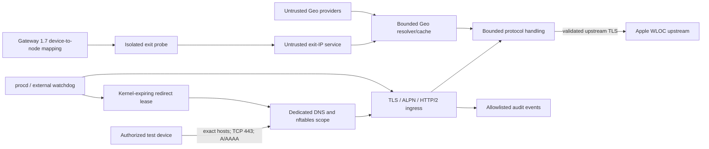

# WLOC router PoC threat model

Status: Phase 0 canonical security specification. This approval is for offline documentation and tests only. It does not authorize protocol patching, certificate generation, router rules, production traffic, or real-device testing.

This model covers one explicitly authorized test device and LAN, the isolated WLOC component, its future router integration boundary, and its upstream dependencies. It intentionally does not describe Apple private protocol fields.

## Security objectives and scope

<!-- SECURITY_INVARIANT id="SCOPE-01" -->

Interception is allowed only when all three predicates match: one assigned test device, one of the six exact WLOC hostnames (`gs-loc.apple.com`, `gs-loc-cn.apple.com`, `gs-loc-corpa.apple.com`, `gs-loc.apple.com.cn`, `bluedot.is.autonavi.com`, or `bluedot.is.autonavi.com.gds.alibabadns.com`), and TCP 443. Matching only an IP address, a hostname suffix, a wildcard, a port, or a device subnet is insufficient. A second exact hostname check is required at TLS ingress because DNS addresses can be shared or poisoned.

<!-- SECURITY_INVARIANT id="GATEWAY-01" -->

The component may create only the dedicated `wificalling_location` table and its fully named objects. It must never modify, reuse, flush, or depend on the `wificalling_gateway` table. UDP 500/4500, ordinary HTTPS, router management, sing-box management/health traffic, and every non-assigned LAN device remain outside the WLOC path. Gateway 1.7 and its running sing-box configuration are read-only dependencies.

The primary security objective is containment and recovery, not guaranteed location modification. Unknown inputs and component failures preserve the original network path or the verified original response; they never expand trust or synthesize a plausible-looking result.

## Assets and trust boundaries

Protected assets are the assigned device's traffic and availability, the router-local CA and leaf keys, Apple upstream identity, node credentials, Geo cache integrity, the dedicated redirect state, Gateway 1.7 state, and privacy-sensitive logs or support bundles.

Trust crosses at:

1. the Authorized test device and untrusted LAN into the exact redirect scope;
2. DNS/IP selection into a second hostname allowlist check;
3. TLS / ALPN / HTTP/2 ingress into bounded parsing;
4. the untrusted proxy path into the independently authenticated Apple WLOC upstream;
5. untrusted exit and Geo providers into schema-, exit-, and expiry-bound data;
6. root-only secrets into lower-privilege UI, logs, backups, and support tooling; and
7. process health into the external watchdog that owns redirect removal.

Root compromise is outside the PoC's confidentiality guarantee, but even a root-local failure must not spread secrets to Git, CI, ordinary backups, support bundles, or other LAN devices.

## Critical and High threat register

Each row names the mandatory control and the future executable or operational evidence required before its implementation phase may exit. This document records requirements, not a claim that those future tests already pass.

| ID | Severity and abuse case | Mandatory control | Required evidence owner |
|---|---|---|---|
| S-01 | Critical: forged Apple upstream or invalid certificate is accepted | Verify the full upstream certificate chain, validity, SNI, and exact hostname with the system or reviewed trust store; never retry with verification disabled | TLS integration: invalid chain, expiry, unknown CA, and hostname mismatch |
| S-02 | High: a spoofed or drifted source enters the redirect | Bind exactly one assigned device to validated address/lease identity and disable interception on binding drift | Network integration: other device, spoofed source, and DHCP drift |
| S-03 | High: poisoned DNS or a shared CDN IP captures another origin | Populate sets from only the six exact names, then require an exact ingress hostname before leaf issuance or proxying | DNS/TLS integration: rotation, shared IP, absent/wrong SNI, ordinary HTTPS |
| T-01 | Critical: WLOC changes the stable Gateway data plane | Operate only fully named `wificalling_location` objects; keep Gateway and sing-box state read-only | OpenWrt integration: before/after semantic diff and zero UDP 500/4500 hits |
| T-02 | High: unknown or malformed protocol is patched or damaged | Patch only an authorized, frozen structure; preserve unknown fields and original bytes otherwise | Protocol: fixture round-trip, malformed, unknown version, order, and fuzz |
| T-03 | High: poisoned, stale, conflicting, or wrong-exit Geo creates a location | Validate schema/ranges/timezone, bind cache to node plus exit IP, enforce expiry, and mark conflicts uncertain | Geo: bad schema, range, conflict, expiry, clock rollback, and exit change |
| I-01 | Critical: CA or leaf private key escapes router-local storage | Generate locally with secure umask, store root-owned mode `0600`, export public certificate only, and exclude private keys from backup/support paths | CA: permissions, backup/support extraction, repository and artifact scans |
| I-02 | Critical: node credentials or provider tokens leak | Pass minimum secrets through bounded root-only inputs; never put them in commands, logs, UCI plaintext, or artifacts; clean temporary state | Exit/Geo: canary scans across failures, process state, temp paths, and artifacts |
| I-03 | High: WLOC body, device identity, or precise location is logged | Construct events only from the log allowlist; do not dump bodies; rotate pseudonyms and logs | Observability: normal/debug/error/crash/rotation canary tests |
| D-01 | High: oversized, compressed, recursive, or malformed input exhausts memory/CPU | Enforce wire, decoded, ratio, allocation, field/depth, and work limits before allocation or parsing | Protocol: oversize, decompression bomb, repetition/depth, fuzz, RSS and deadline |
| D-02 | High: TLS/H2 connection or stream pressure exhausts AX6S | Use bounded queues and limits for connections, streams, headers, frames, flow control, and all deadlines | Proxy: slow client, stream flood, RST_STREAM, GOAWAY, and timeout pressure |
| D-03 | Critical: dead engine or dead supervisor plus a retained redirect causes a persistent blackhole | Gate every redirect match on a kernel-expiring lease; renew it only while engine, scope, and IPv6 health pass; active stop still removes redirect first | AX6S runtime: kill/OOM the engine and supervisor, stop renewal, and measure lease expiry plus the maximum blackhole time |
| D-04 | High: IPv6 bypass or split state causes interception gaps or blackholes | Require one reviewed IPv6 mode before enabling; couple A/AAAA lifecycle and never disable IPv6 globally | Network: dual-stack, IPv6-only, DNS rotation/reload, and ordinary IPv6 isolation |
| E-01 | Critical: the router CA signs an arbitrary identity | Keep signer local and non-networked; require each leaf SAN to equal exactly one approved hostname; reject wildcard, IP, or extra SANs | CA: SAN table tests, cache audit, rotation, and old-cache purge |
| E-02 | High: control/config input injects shell, nft, UCI, or paths | Strict enum/schema/length validation, no shell concatenation, and atomic writes to fixed paths | Control: metacharacter, newline, path traversal, malformed UCI, and overlength |

## CA, TLS, upstream, and HTTP/2 controls

<!-- SECURITY_INVARIANT id="TLS-01" -->

No CA or leaf private key is committed or generated during Phase 0. Future keys must be generated on the authorized router, stored separately from Gateway credentials as root:root mode `0600`, and excluded from UI, logs, support bundles, and ordinary backups. The UI may expose only the public CA certificate and a SHA-256 fingerprint verified over a separate trusted path. Each leaf SAN is exactly one approved hostname; wildcard, IP, suffix, extra-SAN, and arbitrary signing are forbidden. Rotation first removes redirect, then clears the old leaf cache and tells the user to revoke trust on the device.

Downstream support is limited to the reviewed TLS 1.2 and TLS 1.3 baseline. ALPN is explicit: `h2` enters the bounded HTTP/2 stack, an approved HTTP/1.1 result enters only its own parser, and unknown negotiation fails without guessing. The upstream certificate chain, validity, SNI, and hostname are verified independently even when traffic crosses sing-box. Debug modes and retry paths cannot disable verification. A certificate failure produces a controlled WLOC failure, never a fabricated or unverified response.

<!-- SECURITY_INVARIANT id="H2-01" -->

HTTP/2 limits cover SETTINGS, HTTP/2 concurrent streams, header-list bytes, frame/body bytes, flow-control windows, connection lifetime, RST_STREAM, and GOAWAY. Origin and security context key connection reuse; an allowlisted WLOC origin cannot share a pool with another origin.

## IPv4 and IPv6 isolation

<!-- SECURITY_INVARIANT id="IPV6-01" -->

Before any real-device test, a reviewed deployment ADR must choose either a complete dual-stack implementation (IPv4 and IPv6 device/destination sets and redirect with one lifecycle) or scoped AAAA suppression for only the assigned device and six WLOC names. The service must not globally disable IPv6. If neither complete dual-stack nor scoped AAAA suppression is configured and verified, redirect remains absent. Tests must cover dual-stack, IPv6-only connectivity, TTL-driven add/delete, dnsmasq reload, address rotation, device-address drift, ordinary IPv6, and other devices.

## Kernel expiry lease for watchdog loss

The future OpenWrt implementation requires a safety mechanism independent of the continued life of any userspace engine or watchdog. Redirect can match only when the assigned device key is present in dedicated short-TTL nft set elements. The nftables redirect expression must require both the normal device/destination/TCP scope and membership in this live lease set; creating a rule without that match is prohibited.

The external supervisor renews the lease only while engine, scope, and IPv6 health pass. If the supervisor is killed, OOM-terminated, wedged, or unable to check health, renewal stops and the kernel automatically expires the lease. A rule may remain present but cannot redirect without a matching live lease. Startup and reboot begin with no lease, so neither stale userspace state nor a surviving rule enables interception.

This is a required design and test gate, not a claim that a lease mechanism is implemented in Phase 0. The owning implementation Issue must freeze the short TTL and maximum blackhole bound, account for timer/scheduling behavior, and measure the bound on the AX6S by killing or OOM-terminating both engine and supervisor. Active stop still deletes the redirect and verifies absence before stopping the engine; lease expiry is an independent last-resort safety net, not a replacement for cleanup.

## Resource exhaustion controls

<!-- SECURITY_INVARIANT id="RESOURCE-01" -->

All external inputs are hostile and must have explicit, implementation-owned bounds for:

- connections and per-device connections;
- HTTP/2 concurrent streams and bounded queues;
- wire body bytes and decoded body bytes;
- decompression ratio;
- allocation and parse work, depth, and field count;
- handshake, upstream, read, and idle timeouts;
- respawn rate; and
- a 1 MiB log cap with rotation.

Over-limit content is not parsed, cached, or logged as a body. Exhausted audit storage cannot justify continued interception: the safe response is to disable MITM and remove redirect. Numeric values must be frozen by the owning implementation Issue and demonstrated on the AX6S before real-device testing.

## Logging, support bundles, and privacy

<!-- SECURITY_INVARIANT id="PRIVACY-01" -->

The event allowlist is limited to event type, one exact approved hostname, success/failure category, bounded byte counts, coarse country/city, a rotating non-reversible device pseudonym, state generation, and coarse time. Logs are rotated under the 1 MiB cap.

Logs and support bundles must exclude request or response bodies, Wi-Fi/BSSID/cell data, device MAC or IP, precise coordinates, CA or leaf private keys, node credentials, provider tokens, complete share links, packet captures, raw provider responses, and temporary node configuration. Support bundles are reconstructed from allowed fields rather than copying files and attempting regex cleanup. Canary tests cover normal, debug, error, crash, and rotation paths.

## Emergency, authorization, and compliance limits

<!-- SECURITY_INVARIANT id="COMPLIANCE-01" -->

This PoC is restricted to the owner's authorized test device and LAN. It does not guarantee emergency-call location, does not certify carrier compliance, and does not prove Wi-Fi Calling activation. City-level IP Geo is neither GPS nor the user's verified physical location and must not drive navigation, dispatch, emergency response, or another safety-critical decision. Calling tests, if later authorized, are regression observations rather than emergency-service certification.

The feature is off by default. Real-device work additionally requires closed license and authorized-fixture gates, independent security review, verified CA fingerprint and revocation instructions, a defined test window and rollback owner, an approved IPv6 mode, resource measurements, and executable isolation/failure evidence.

## Review and rollback

Any added device, hostname, protocol variant, TLS/H2 library, Geo provider, remote administration surface, persistent package, log field, Gateway integration behavior, IPv6 strategy, or relaxed resource bound requires threat-model review. A security control may be relaxed only by a reviewed superseding ADR. Until all later implementation gates pass, this specification authorizes no certificate, redirect, live traffic, or device access.
